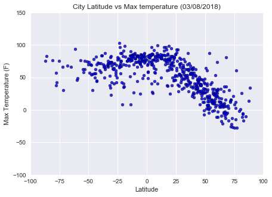
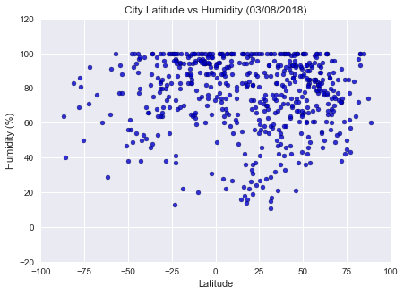
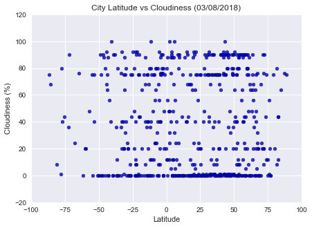
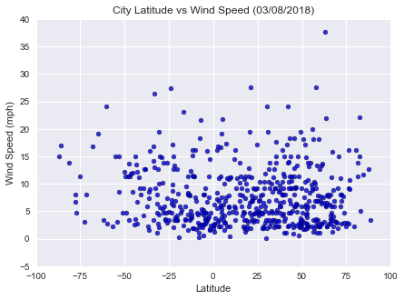

# WeatherPy Analysis¶
•	The co-ordinate data was randomly chosen to give a uniform distribution of the Cities around the globe.

•	Temperature vs Latitude: The Max Temp vs Latititude plot clearly shows that the Cities with Latitude values closer to 0 (closer to Equator) have higher max temeratures than the cities away from the Equator. The max temperature is around 80 F within 20 S - 16 N degrees and then falls to about 10 F as the latitude increases in the northern hemisphere. This implies that on average the southern hemisphere is warmer than the northern hemisphere.

•	Humidity vs Latitude: There is no clear relation between the humidity and latitude. Although, if we take a closer look, we can see that the humidity is between 60-100%  in the cities that lie between 40deg S and 70deg N. We may need to further study the humidity data with the Longitude data to see how the oceans and land temperatures and cloud cover affect it.

•	Cloudiness vs Latitude: There is no clear relation between the cloudiness and latitude based on our data. We can see a cloudiness of 0% as well as 80% throughout the range of our data. This does not show a clear pattern.  The cloudiness varies seasonally and this may be the reason why our current datapoints (single date stamp) may not reflect a pattern. We may need to further collect more data on a seasonal and the time of the day basis.

•	Wind Speeds vs Latitude: There is no clear relation between the wind speeds and latitude based on our data. Most of the windspeed seems to be between 0-10mph throughout the range of latitudes considered in our data.


```python
# Dependencies
import pandas as pd
import numpy as np
import matplotlib.pyplot as plt
import seaborn as sns
import json
import requests
import time
from citipy import citipy
from config import api_key
import warnings
warnings.filterwarnings(action='once')

```


```python
# create empty dictionary for latitude and longitude
coords = {"Latitude": [], "Longitude": []}

# define a function to generate 100 random numbers (with random.uniform for uniform distribution of data) for 
# latitude and longitude in the given ranges. We'll be calling this function multiple times to get to 500 cities 
# with proper data.

def get_coord():    
    #coords = {"Latitude": [], "Longitude": []}
    for x in range(100):
        lat = np.random.uniform(low=-90, high=90)
        long = np.random.uniform(low=-180, high=180)
        coords["Latitude"].append(lat)
        coords["Longitude"].append(long)
        
# call the lat/long function and create a base dataframe with the lat and long values
get_coord()
lat_long_df = pd.DataFrame(coords)

# print the dataframe
lat_long_df.head()
```


<div>
<style>
    .dataframe thead tr:only-child th {
        text-align: right;
    }

    .dataframe thead th {
        text-align: left;
    }

    .dataframe tbody tr th {
        vertical-align: top;
    }
</style>
<table border="1" class="dataframe">
  <thead>
    <tr style="text-align: right;">
      <th></th>
      <th>Latitude</th>
      <th>Longitude</th>
    </tr>
  </thead>
  <tbody>
    <tr>
      <th>0</th>
      <td>-30.042485</td>
      <td>159.931024</td>
    </tr>
    <tr>
      <th>1</th>
      <td>-21.669445</td>
      <td>31.968035</td>
    </tr>
    <tr>
      <th>2</th>
      <td>81.111269</td>
      <td>-9.443372</td>
    </tr>
    <tr>
      <th>3</th>
      <td>82.547830</td>
      <td>47.729042</td>
    </tr>
    <tr>
      <th>4</th>
      <td>53.407040</td>
      <td>148.438182</td>
    </tr>
  </tbody>
</table>
</div>


```python
# get the nearest cities to the coordinates in the dataframe

# create emptylist for the cities
cities = []

# create a loop to run through all the coordinate rows in the dataframe and get the nearest city using citypy
for index, row in lat_long_df.iterrows():
    city = citipy.nearest_city(row["Latitude"], row["Longitude"])
    city_name = city.city_name
    # add the city name to the list
    cities.append(city_name)

# assign the dataframe to df
df= lat_long_df

# create a function for getting city names using df as the dataframe
def get_cities():
    for index, row in df.iterrows():
        city = citipy.nearest_city(row["Latitude"], row["Longitude"])
    #print(city)
        city_name = city.city_name
        cities.append(city_name)
    
# add the cities to the cities column in the base dataframe
lat_long_df["Cities"] = cities

# print the dataframe
lat_long_df.head()
```


<div>
<style>
    .dataframe thead tr:only-child th {
        text-align: right;
    }

    .dataframe thead th {
        text-align: left;
    }

    .dataframe tbody tr th {
        vertical-align: top;
    }
</style>
<table border="1" class="dataframe">
  <thead>
    <tr style="text-align: right;">
      <th></th>
      <th>Latitude</th>
      <th>Longitude</th>
      <th>Cities</th>
    </tr>
  </thead>
  <tbody>
    <tr>
      <th>0</th>
      <td>-30.042485</td>
      <td>159.931024</td>
      <td>byron bay</td>
    </tr>
    <tr>
      <th>1</th>
      <td>-21.669445</td>
      <td>31.968035</td>
      <td>chiredzi</td>
    </tr>
    <tr>
      <th>2</th>
      <td>81.111269</td>
      <td>-9.443372</td>
      <td>illoqqortoormiut</td>
    </tr>
    <tr>
      <th>3</th>
      <td>82.547830</td>
      <td>47.729042</td>
      <td>belushya guba</td>
    </tr>
    <tr>
      <th>4</th>
      <td>53.407040</td>
      <td>148.438182</td>
      <td>vostok</td>
    </tr>
  </tbody>
</table>
</div>


```python
# get the count of unique cities in the dataframe
cities_unique = lat_long_df["Cities"].unique()
print(f"Unique Cities: {len(cities_unique)}")
```

    Unique Cities: 83
    


```python
# call the lat/long function and cities function multiple times till we get >=500 non-repeating cities in the dataframe

while len(cities_unique) < 600:
    coord = []
    get_coord()
    
    # add the new co-ordinates to a nother dataframe
    new_data_df = pd.DataFrame(coords)
    
    # assign the dataframe to df
    df = new_data_df
    
    cities = []
    get_cities()
    # add the cities to the cities column in this new dataframe
    df["Cities"] = cities
    
    # append the new dataframe to the base dataframe
    lat_long_df = lat_long_df.append(df)
    
    cities_unique = lat_long_df["Cities"].unique()
        
print(f"Count of unique cities generated randomly: {len(cities_unique)}")
```

    Count of unique cities generated randomly: 616
    


```python
# drop the rows with duplicate cities
lat_long_unique_cities_df = lat_long_df.drop_duplicates(subset=["Cities"])
lat_long_unique_cities_df.reset_index(drop=True)

# print number of rows in the dataframe (to confirm there are no repeating cities)
print(f"Number of rows in the dataframe: {len(lat_long_unique_cities_df)}")
```

    Number of rows in the dataframe: 616
    


```python
# Open weather url
url = "http://api.openweathermap.org/data/2.5/weather?"

# create empty lists for country, date, temperatures, humidity, wind speeds and cloudiness.
city_ids = []
countries = []
date_current = []
max_temps = []
hums = []
winds = []
clouds = []

# delcare the units as Imperial
units = "Imperial"

# row counter
row_count = 0

# loop throught the rows of the dataframe
for index, row in lat_long_unique_cities_df.iterrows():
    
    # Build query URL
    city = row["Cities"]
    query_url = url + "units=" + units + "&" + "appid=" + api_key + "&q=" + city
    
# Get weather data
    weather_response = requests.get(query_url)
    weather_json = weather_response.json()
    
    # set the row counter
    row_count = row_count + 1
    
    # print log to make sure that the loop is working correctly.
    print("Retrieving City # " + str(row_count))
    print(query_url)
    
    # Get the various data from the response
    # append the weather data to the respective lists.
    # skip the cities with errors using try/except (when city ID is NaN)
    try:
        city_id = weather_json.get("id")
        country = weather_json.get("sys").get("country")
        date = weather_json.get("dt")
        max_temp = weather_json.get("main").get("temp_max")
        hum = weather_json.get("main").get("humidity")
        clo = weather_json.get("clouds").get("all")
        win = weather_json.get("wind").get("speed")
  
        
    except:
        print(f"{city}: Error with weather data... skipping.")
            
    # append to the lists
    city_ids.append(city_id)
    countries.append(country)
    date_current.append(date)
    max_temps.append(max_temp)
    hums.append(hum)
    clouds.append(clo)
    winds.append(win) 
    

```

    Retrieving City # 1
    http://api.openweathermap.org/data/2.5/weather?units=Imperial&appid=663f03d136f4e7ef6a64a732fed8e088&q=byron bay
    Retrieving City # 2
    http://api.openweathermap.org/data/2.5/weather?units=Imperial&appid=663f03d136f4e7ef6a64a732fed8e088&q=chiredzi
    Retrieving City # 3
    http://api.openweathermap.org/data/2.5/weather?units=Imperial&appid=663f03d136f4e7ef6a64a732fed8e088&q=illoqqortoormiut
    illoqqortoormiut: Error with weather data... skipping.
    Retrieving City # 4
    http://api.openweathermap.org/data/2.5/weather?units=Imperial&appid=663f03d136f4e7ef6a64a732fed8e088&q=belushya guba
    belushya guba: Error with weather data... skipping.
    Retrieving City # 5
    http://api.openweathermap.org/data/2.5/weather?units=Imperial&appid=663f03d136f4e7ef6a64a732fed8e088&q=vostok
    Retrieving City # 6
    http://api.openweathermap.org/data/2.5/weather?units=Imperial&appid=663f03d136f4e7ef6a64a732fed8e088&q=upernavik
    Retrieving City # 7
    http://api.openweathermap.org/data/2.5/weather?units=Imperial&appid=663f03d136f4e7ef6a64a732fed8e088&q=fairbanks
    Retrieving City # 8
    http://api.openweathermap.org/data/2.5/weather?units=Imperial&appid=663f03d136f4e7ef6a64a732fed8e088&q=tautira
    Retrieving City # 9
    http://api.openweathermap.org/data/2.5/weather?units=Imperial&appid=663f03d136f4e7ef6a64a732fed8e088&q=castro
    Retrieving City # 10
    http://api.openweathermap.org/data/2.5/weather?units=Imperial&appid=663f03d136f4e7ef6a64a732fed8e088&q=taolanaro
    taolanaro: Error with weather data... skipping.
    Retrieving City # 11
    http://api.openweathermap.org/data/2.5/weather?units=Imperial&appid=663f03d136f4e7ef6a64a732fed8e088&q=santa cruz
    Retrieving City # 12
    http://api.openweathermap.org/data/2.5/weather?units=Imperial&appid=663f03d136f4e7ef6a64a732fed8e088&q=cockburn town
    Retrieving City # 13
    http://api.openweathermap.org/data/2.5/weather?units=Imperial&appid=663f03d136f4e7ef6a64a732fed8e088&q=qaanaaq
    Retrieving City # 14
    http://api.openweathermap.org/data/2.5/weather?units=Imperial&appid=663f03d136f4e7ef6a64a732fed8e088&q=fortuna
    Retrieving City # 15
    http://api.openweathermap.org/data/2.5/weather?units=Imperial&appid=663f03d136f4e7ef6a64a732fed8e088&q=bluff
    Retrieving City # 16
    http://api.openweathermap.org/data/2.5/weather?units=Imperial&appid=663f03d136f4e7ef6a64a732fed8e088&q=quelimane
    Retrieving City # 17
    http://api.openweathermap.org/data/2.5/weather?units=Imperial&appid=663f03d136f4e7ef6a64a732fed8e088&q=terney
    Retrieving City # 18
    http://api.openweathermap.org/data/2.5/weather?units=Imperial&appid=663f03d136f4e7ef6a64a732fed8e088&q=bengkulu
    bengkulu: Error with weather data... skipping.
    Retrieving City # 19
    http://api.openweathermap.org/data/2.5/weather?units=Imperial&appid=663f03d136f4e7ef6a64a732fed8e088&q=sangin
    Retrieving City # 20
    http://api.openweathermap.org/data/2.5/weather?units=Imperial&appid=663f03d136f4e7ef6a64a732fed8e088&q=odda
    Retrieving City # 21
    http://api.openweathermap.org/data/2.5/weather?units=Imperial&appid=663f03d136f4e7ef6a64a732fed8e088&q=hilo
    Retrieving City # 22
    http://api.openweathermap.org/data/2.5/weather?units=Imperial&appid=663f03d136f4e7ef6a64a732fed8e088&q=torbay
    Retrieving City # 23
    http://api.openweathermap.org/data/2.5/weather?units=Imperial&appid=663f03d136f4e7ef6a64a732fed8e088&q=puerto narino
    Retrieving City # 24
    http://api.openweathermap.org/data/2.5/weather?units=Imperial&appid=663f03d136f4e7ef6a64a732fed8e088&q=luderitz
    Retrieving City # 25
    http://api.openweathermap.org/data/2.5/weather?units=Imperial&appid=663f03d136f4e7ef6a64a732fed8e088&q=bambous virieux
    Retrieving City # 26
    http://api.openweathermap.org/data/2.5/weather?units=Imperial&appid=663f03d136f4e7ef6a64a732fed8e088&q=vancouver
    Retrieving City # 27
    http://api.openweathermap.org/data/2.5/weather?units=Imperial&appid=663f03d136f4e7ef6a64a732fed8e088&q=neuquen
    Retrieving City # 28
    http://api.openweathermap.org/data/2.5/weather?units=Imperial&appid=663f03d136f4e7ef6a64a732fed8e088&q=attawapiskat
    attawapiskat: Error with weather data... skipping.
    Retrieving City # 29
    http://api.openweathermap.org/data/2.5/weather?units=Imperial&appid=663f03d136f4e7ef6a64a732fed8e088&q=saint-philippe
    Retrieving City # 30
    http://api.openweathermap.org/data/2.5/weather?units=Imperial&appid=663f03d136f4e7ef6a64a732fed8e088&q=kapaa
    Retrieving City # 31
    http://api.openweathermap.org/data/2.5/weather?units=Imperial&appid=663f03d136f4e7ef6a64a732fed8e088&q=mataura
    Retrieving City # 32
    http://api.openweathermap.org/data/2.5/weather?units=Imperial&appid=663f03d136f4e7ef6a64a732fed8e088&q=port alfred
    Retrieving City # 33
    http://api.openweathermap.org/data/2.5/weather?units=Imperial&appid=663f03d136f4e7ef6a64a732fed8e088&q=rikitea
    Retrieving City # 34
    http://api.openweathermap.org/data/2.5/weather?units=Imperial&appid=663f03d136f4e7ef6a64a732fed8e088&q=busselton
    Retrieving City # 35
    http://api.openweathermap.org/data/2.5/weather?units=Imperial&appid=663f03d136f4e7ef6a64a732fed8e088&q=bulgan
    Retrieving City # 36
    http://api.openweathermap.org/data/2.5/weather?units=Imperial&appid=663f03d136f4e7ef6a64a732fed8e088&q=kodiak
    Retrieving City # 37
    http://api.openweathermap.org/data/2.5/weather?units=Imperial&appid=663f03d136f4e7ef6a64a732fed8e088&q=atuona
    Retrieving City # 38
    http://api.openweathermap.org/data/2.5/weather?units=Imperial&appid=663f03d136f4e7ef6a64a732fed8e088&q=oranjemund
    Retrieving City # 39
    http://api.openweathermap.org/data/2.5/weather?units=Imperial&appid=663f03d136f4e7ef6a64a732fed8e088&q=yajalon
    Retrieving City # 40
    http://api.openweathermap.org/data/2.5/weather?units=Imperial&appid=663f03d136f4e7ef6a64a732fed8e088&q=fort nelson
    Retrieving City # 41
    http://api.openweathermap.org/data/2.5/weather?units=Imperial&appid=663f03d136f4e7ef6a64a732fed8e088&q=saskylakh
    Retrieving City # 42
    http://api.openweathermap.org/data/2.5/weather?units=Imperial&appid=663f03d136f4e7ef6a64a732fed8e088&q=ribeira grande
    Retrieving City # 43
    http://api.openweathermap.org/data/2.5/weather?units=Imperial&appid=663f03d136f4e7ef6a64a732fed8e088&q=xiaoweizhai
    Retrieving City # 44
    http://api.openweathermap.org/data/2.5/weather?units=Imperial&appid=663f03d136f4e7ef6a64a732fed8e088&q=wulanhaote
    wulanhaote: Error with weather data... skipping.
    Retrieving City # 45
    http://api.openweathermap.org/data/2.5/weather?units=Imperial&appid=663f03d136f4e7ef6a64a732fed8e088&q=east london
    Retrieving City # 46
    http://api.openweathermap.org/data/2.5/weather?units=Imperial&appid=663f03d136f4e7ef6a64a732fed8e088&q=dingle
    Retrieving City # 47
    http://api.openweathermap.org/data/2.5/weather?units=Imperial&appid=663f03d136f4e7ef6a64a732fed8e088&q=saldanha
    Retrieving City # 48
    http://api.openweathermap.org/data/2.5/weather?units=Imperial&appid=663f03d136f4e7ef6a64a732fed8e088&q=honningsvag
    Retrieving City # 49
    http://api.openweathermap.org/data/2.5/weather?units=Imperial&appid=663f03d136f4e7ef6a64a732fed8e088&q=punta arenas
    Retrieving City # 50
    http://api.openweathermap.org/data/2.5/weather?units=Imperial&appid=663f03d136f4e7ef6a64a732fed8e088&q=barrow
    Retrieving City # 51
    http://api.openweathermap.org/data/2.5/weather?units=Imperial&appid=663f03d136f4e7ef6a64a732fed8e088&q=baghramyan
    Retrieving City # 52
    http://api.openweathermap.org/data/2.5/weather?units=Imperial&appid=663f03d136f4e7ef6a64a732fed8e088&q=meyungs
    meyungs: Error with weather data... skipping.
    Retrieving City # 53
    http://api.openweathermap.org/data/2.5/weather?units=Imperial&appid=663f03d136f4e7ef6a64a732fed8e088&q=mahaicony
    mahaicony: Error with weather data... skipping.
    Retrieving City # 54
    http://api.openweathermap.org/data/2.5/weather?units=Imperial&appid=663f03d136f4e7ef6a64a732fed8e088&q=clyde river
    Retrieving City # 55
    http://api.openweathermap.org/data/2.5/weather?units=Imperial&appid=663f03d136f4e7ef6a64a732fed8e088&q=puerto ayora
    Retrieving City # 56
    http://api.openweathermap.org/data/2.5/weather?units=Imperial&appid=663f03d136f4e7ef6a64a732fed8e088&q=tasiilaq
    Retrieving City # 57
    http://api.openweathermap.org/data/2.5/weather?units=Imperial&appid=663f03d136f4e7ef6a64a732fed8e088&q=thompson
    Retrieving City # 58
    http://api.openweathermap.org/data/2.5/weather?units=Imperial&appid=663f03d136f4e7ef6a64a732fed8e088&q=husavik
    Retrieving City # 59
    http://api.openweathermap.org/data/2.5/weather?units=Imperial&appid=663f03d136f4e7ef6a64a732fed8e088&q=geraldton
    Retrieving City # 60
    http://api.openweathermap.org/data/2.5/weather?units=Imperial&appid=663f03d136f4e7ef6a64a732fed8e088&q=sao manuel
    Retrieving City # 61
    http://api.openweathermap.org/data/2.5/weather?units=Imperial&appid=663f03d136f4e7ef6a64a732fed8e088&q=buta
    Retrieving City # 62
    http://api.openweathermap.org/data/2.5/weather?units=Imperial&appid=663f03d136f4e7ef6a64a732fed8e088&q=shakawe
    Retrieving City # 63
    http://api.openweathermap.org/data/2.5/weather?units=Imperial&appid=663f03d136f4e7ef6a64a732fed8e088&q=bereda
    Retrieving City # 64
    http://api.openweathermap.org/data/2.5/weather?units=Imperial&appid=663f03d136f4e7ef6a64a732fed8e088&q=hermanus
    Retrieving City # 65
    http://api.openweathermap.org/data/2.5/weather?units=Imperial&appid=663f03d136f4e7ef6a64a732fed8e088&q=albany
    Retrieving City # 66
    http://api.openweathermap.org/data/2.5/weather?units=Imperial&appid=663f03d136f4e7ef6a64a732fed8e088&q=pahrump
    Retrieving City # 67
    http://api.openweathermap.org/data/2.5/weather?units=Imperial&appid=663f03d136f4e7ef6a64a732fed8e088&q=lagoa
    Retrieving City # 68
    http://api.openweathermap.org/data/2.5/weather?units=Imperial&appid=663f03d136f4e7ef6a64a732fed8e088&q=ushuaia
    Retrieving City # 69
    http://api.openweathermap.org/data/2.5/weather?units=Imperial&appid=663f03d136f4e7ef6a64a732fed8e088&q=perth
    Retrieving City # 70
    http://api.openweathermap.org/data/2.5/weather?units=Imperial&appid=663f03d136f4e7ef6a64a732fed8e088&q=dusti
    Retrieving City # 71
    http://api.openweathermap.org/data/2.5/weather?units=Imperial&appid=663f03d136f4e7ef6a64a732fed8e088&q=sierra vista
    Retrieving City # 72
    http://api.openweathermap.org/data/2.5/weather?units=Imperial&appid=663f03d136f4e7ef6a64a732fed8e088&q=provideniya
    Retrieving City # 73
    http://api.openweathermap.org/data/2.5/weather?units=Imperial&appid=663f03d136f4e7ef6a64a732fed8e088&q=nanchang
    Retrieving City # 74
    http://api.openweathermap.org/data/2.5/weather?units=Imperial&appid=663f03d136f4e7ef6a64a732fed8e088&q=airai
    Retrieving City # 75
    http://api.openweathermap.org/data/2.5/weather?units=Imperial&appid=663f03d136f4e7ef6a64a732fed8e088&q=beyneu
    Retrieving City # 76
    http://api.openweathermap.org/data/2.5/weather?units=Imperial&appid=663f03d136f4e7ef6a64a732fed8e088&q=avarua
    Retrieving City # 77
    http://api.openweathermap.org/data/2.5/weather?units=Imperial&appid=663f03d136f4e7ef6a64a732fed8e088&q=kashi
    kashi: Error with weather data... skipping.
    Retrieving City # 78
    http://api.openweathermap.org/data/2.5/weather?units=Imperial&appid=663f03d136f4e7ef6a64a732fed8e088&q=ponta do sol
    Retrieving City # 79
    http://api.openweathermap.org/data/2.5/weather?units=Imperial&appid=663f03d136f4e7ef6a64a732fed8e088&q=shingu
    Retrieving City # 80
    http://api.openweathermap.org/data/2.5/weather?units=Imperial&appid=663f03d136f4e7ef6a64a732fed8e088&q=touros
    Retrieving City # 81
    http://api.openweathermap.org/data/2.5/weather?units=Imperial&appid=663f03d136f4e7ef6a64a732fed8e088&q=mandalgovi
    Retrieving City # 82
    http://api.openweathermap.org/data/2.5/weather?units=Imperial&appid=663f03d136f4e7ef6a64a732fed8e088&q=barentsburg
    barentsburg: Error with weather data... skipping.
    Retrieving City # 83
    http://api.openweathermap.org/data/2.5/weather?units=Imperial&appid=663f03d136f4e7ef6a64a732fed8e088&q=severo-kurilsk
    Retrieving City # 84
    http://api.openweathermap.org/data/2.5/weather?units=Imperial&appid=663f03d136f4e7ef6a64a732fed8e088&q=cape town
    Retrieving City # 85
    http://api.openweathermap.org/data/2.5/weather?units=Imperial&appid=663f03d136f4e7ef6a64a732fed8e088&q=karaul
    karaul: Error with weather data... skipping.
    Retrieving City # 86
    http://api.openweathermap.org/data/2.5/weather?units=Imperial&appid=663f03d136f4e7ef6a64a732fed8e088&q=kaitangata
    Retrieving City # 87
    http://api.openweathermap.org/data/2.5/weather?units=Imperial&appid=663f03d136f4e7ef6a64a732fed8e088&q=katsuura
    Retrieving City # 88
    http://api.openweathermap.org/data/2.5/weather?units=Imperial&appid=663f03d136f4e7ef6a64a732fed8e088&q=kahului
    Retrieving City # 89
    http://api.openweathermap.org/data/2.5/weather?units=Imperial&appid=663f03d136f4e7ef6a64a732fed8e088&q=panjab
    Retrieving City # 90
    http://api.openweathermap.org/data/2.5/weather?units=Imperial&appid=663f03d136f4e7ef6a64a732fed8e088&q=tiksi
    Retrieving City # 91
    http://api.openweathermap.org/data/2.5/weather?units=Imperial&appid=663f03d136f4e7ef6a64a732fed8e088&q=norman wells
    Retrieving City # 92
    http://api.openweathermap.org/data/2.5/weather?units=Imperial&appid=663f03d136f4e7ef6a64a732fed8e088&q=tual
    Retrieving City # 93
    http://api.openweathermap.org/data/2.5/weather?units=Imperial&appid=663f03d136f4e7ef6a64a732fed8e088&q=port elizabeth
    Retrieving City # 94
    http://api.openweathermap.org/data/2.5/weather?units=Imperial&appid=663f03d136f4e7ef6a64a732fed8e088&q=jamestown
    Retrieving City # 95
    http://api.openweathermap.org/data/2.5/weather?units=Imperial&appid=663f03d136f4e7ef6a64a732fed8e088&q=smithers
    Retrieving City # 96
    http://api.openweathermap.org/data/2.5/weather?units=Imperial&appid=663f03d136f4e7ef6a64a732fed8e088&q=avera
    Retrieving City # 97
    http://api.openweathermap.org/data/2.5/weather?units=Imperial&appid=663f03d136f4e7ef6a64a732fed8e088&q=saleaula
    saleaula: Error with weather data... skipping.
    Retrieving City # 98
    http://api.openweathermap.org/data/2.5/weather?units=Imperial&appid=663f03d136f4e7ef6a64a732fed8e088&q=port hedland
    Retrieving City # 99
    http://api.openweathermap.org/data/2.5/weather?units=Imperial&appid=663f03d136f4e7ef6a64a732fed8e088&q=sao joao da barra
    Retrieving City # 100
    http://api.openweathermap.org/data/2.5/weather?units=Imperial&appid=663f03d136f4e7ef6a64a732fed8e088&q=camaguey
    Retrieving City # 101
    http://api.openweathermap.org/data/2.5/weather?units=Imperial&appid=663f03d136f4e7ef6a64a732fed8e088&q=bereznik
    Retrieving City # 102
    http://api.openweathermap.org/data/2.5/weather?units=Imperial&appid=663f03d136f4e7ef6a64a732fed8e088&q=dabakala
    Retrieving City # 103
    http://api.openweathermap.org/data/2.5/weather?units=Imperial&appid=663f03d136f4e7ef6a64a732fed8e088&q=bubaque
    Retrieving City # 104
    http://api.openweathermap.org/data/2.5/weather?units=Imperial&appid=663f03d136f4e7ef6a64a732fed8e088&q=sao felix do xingu
    Retrieving City # 105
    http://api.openweathermap.org/data/2.5/weather?units=Imperial&appid=663f03d136f4e7ef6a64a732fed8e088&q=teya
    Retrieving City # 106
    http://api.openweathermap.org/data/2.5/weather?units=Imperial&appid=663f03d136f4e7ef6a64a732fed8e088&q=henties bay
    Retrieving City # 107
    http://api.openweathermap.org/data/2.5/weather?units=Imperial&appid=663f03d136f4e7ef6a64a732fed8e088&q=khuzhir
    Retrieving City # 108
    http://api.openweathermap.org/data/2.5/weather?units=Imperial&appid=663f03d136f4e7ef6a64a732fed8e088&q=mahon
    Retrieving City # 109
    http://api.openweathermap.org/data/2.5/weather?units=Imperial&appid=663f03d136f4e7ef6a64a732fed8e088&q=nizhneyansk
    nizhneyansk: Error with weather data... skipping.
    Retrieving City # 110
    http://api.openweathermap.org/data/2.5/weather?units=Imperial&appid=663f03d136f4e7ef6a64a732fed8e088&q=new norfolk
    Retrieving City # 111
    http://api.openweathermap.org/data/2.5/weather?units=Imperial&appid=663f03d136f4e7ef6a64a732fed8e088&q=vaini
    Retrieving City # 112
    http://api.openweathermap.org/data/2.5/weather?units=Imperial&appid=663f03d136f4e7ef6a64a732fed8e088&q=seoul
    Retrieving City # 113
    http://api.openweathermap.org/data/2.5/weather?units=Imperial&appid=663f03d136f4e7ef6a64a732fed8e088&q=pevek
    Retrieving City # 114
    http://api.openweathermap.org/data/2.5/weather?units=Imperial&appid=663f03d136f4e7ef6a64a732fed8e088&q=ihosy
    Retrieving City # 115
    http://api.openweathermap.org/data/2.5/weather?units=Imperial&appid=663f03d136f4e7ef6a64a732fed8e088&q=san lorenzo
    Retrieving City # 116
    http://api.openweathermap.org/data/2.5/weather?units=Imperial&appid=663f03d136f4e7ef6a64a732fed8e088&q=dikson
    Retrieving City # 117
    http://api.openweathermap.org/data/2.5/weather?units=Imperial&appid=663f03d136f4e7ef6a64a732fed8e088&q=bredasdorp
    Retrieving City # 118
    http://api.openweathermap.org/data/2.5/weather?units=Imperial&appid=663f03d136f4e7ef6a64a732fed8e088&q=calabozo
    Retrieving City # 119
    http://api.openweathermap.org/data/2.5/weather?units=Imperial&appid=663f03d136f4e7ef6a64a732fed8e088&q=nanma
    Retrieving City # 120
    http://api.openweathermap.org/data/2.5/weather?units=Imperial&appid=663f03d136f4e7ef6a64a732fed8e088&q=mar del plata
    Retrieving City # 121
    http://api.openweathermap.org/data/2.5/weather?units=Imperial&appid=663f03d136f4e7ef6a64a732fed8e088&q=williams lake
    Retrieving City # 122
    http://api.openweathermap.org/data/2.5/weather?units=Imperial&appid=663f03d136f4e7ef6a64a732fed8e088&q=hithadhoo
    Retrieving City # 123
    http://api.openweathermap.org/data/2.5/weather?units=Imperial&appid=663f03d136f4e7ef6a64a732fed8e088&q=kichera
    Retrieving City # 124
    http://api.openweathermap.org/data/2.5/weather?units=Imperial&appid=663f03d136f4e7ef6a64a732fed8e088&q=cabedelo
    Retrieving City # 125
    http://api.openweathermap.org/data/2.5/weather?units=Imperial&appid=663f03d136f4e7ef6a64a732fed8e088&q=hobart
    Retrieving City # 126
    http://api.openweathermap.org/data/2.5/weather?units=Imperial&appid=663f03d136f4e7ef6a64a732fed8e088&q=sinnamary
    Retrieving City # 127
    http://api.openweathermap.org/data/2.5/weather?units=Imperial&appid=663f03d136f4e7ef6a64a732fed8e088&q=acapulco
    Retrieving City # 128
    http://api.openweathermap.org/data/2.5/weather?units=Imperial&appid=663f03d136f4e7ef6a64a732fed8e088&q=hobyo
    Retrieving City # 129
    http://api.openweathermap.org/data/2.5/weather?units=Imperial&appid=663f03d136f4e7ef6a64a732fed8e088&q=villazon
    villazon: Error with weather data... skipping.
    Retrieving City # 130
    http://api.openweathermap.org/data/2.5/weather?units=Imperial&appid=663f03d136f4e7ef6a64a732fed8e088&q=maryville
    Retrieving City # 131
    http://api.openweathermap.org/data/2.5/weather?units=Imperial&appid=663f03d136f4e7ef6a64a732fed8e088&q=yuzhno-sukhokumsk
    Retrieving City # 132
    http://api.openweathermap.org/data/2.5/weather?units=Imperial&appid=663f03d136f4e7ef6a64a732fed8e088&q=catuday
    Retrieving City # 133
    http://api.openweathermap.org/data/2.5/weather?units=Imperial&appid=663f03d136f4e7ef6a64a732fed8e088&q=tuktoyaktuk
    Retrieving City # 134
    http://api.openweathermap.org/data/2.5/weather?units=Imperial&appid=663f03d136f4e7ef6a64a732fed8e088&q=vao
    Retrieving City # 135
    http://api.openweathermap.org/data/2.5/weather?units=Imperial&appid=663f03d136f4e7ef6a64a732fed8e088&q=miraflores
    Retrieving City # 136
    http://api.openweathermap.org/data/2.5/weather?units=Imperial&appid=663f03d136f4e7ef6a64a732fed8e088&q=havoysund
    Retrieving City # 137
    http://api.openweathermap.org/data/2.5/weather?units=Imperial&appid=663f03d136f4e7ef6a64a732fed8e088&q=klaksvik
    Retrieving City # 138
    http://api.openweathermap.org/data/2.5/weather?units=Imperial&appid=663f03d136f4e7ef6a64a732fed8e088&q=nanortalik
    Retrieving City # 139
    http://api.openweathermap.org/data/2.5/weather?units=Imperial&appid=663f03d136f4e7ef6a64a732fed8e088&q=chokurdakh
    Retrieving City # 140
    http://api.openweathermap.org/data/2.5/weather?units=Imperial&appid=663f03d136f4e7ef6a64a732fed8e088&q=ponta delgada
    Retrieving City # 141
    http://api.openweathermap.org/data/2.5/weather?units=Imperial&appid=663f03d136f4e7ef6a64a732fed8e088&q=mudkhed
    Retrieving City # 142
    http://api.openweathermap.org/data/2.5/weather?units=Imperial&appid=663f03d136f4e7ef6a64a732fed8e088&q=tsihombe
    tsihombe: Error with weather data... skipping.
    Retrieving City # 143
    http://api.openweathermap.org/data/2.5/weather?units=Imperial&appid=663f03d136f4e7ef6a64a732fed8e088&q=belaya kholunitsa
    Retrieving City # 144
    http://api.openweathermap.org/data/2.5/weather?units=Imperial&appid=663f03d136f4e7ef6a64a732fed8e088&q=faanui
    Retrieving City # 145
    http://api.openweathermap.org/data/2.5/weather?units=Imperial&appid=663f03d136f4e7ef6a64a732fed8e088&q=sibolga
    Retrieving City # 146
    http://api.openweathermap.org/data/2.5/weather?units=Imperial&appid=663f03d136f4e7ef6a64a732fed8e088&q=sioux lookout
    Retrieving City # 147
    http://api.openweathermap.org/data/2.5/weather?units=Imperial&appid=663f03d136f4e7ef6a64a732fed8e088&q=sinkat
    sinkat: Error with weather data... skipping.
    Retrieving City # 148
    http://api.openweathermap.org/data/2.5/weather?units=Imperial&appid=663f03d136f4e7ef6a64a732fed8e088&q=ibra
    Retrieving City # 149
    http://api.openweathermap.org/data/2.5/weather?units=Imperial&appid=663f03d136f4e7ef6a64a732fed8e088&q=santiago
    Retrieving City # 150
    http://api.openweathermap.org/data/2.5/weather?units=Imperial&appid=663f03d136f4e7ef6a64a732fed8e088&q=les cayes
    Retrieving City # 151
    http://api.openweathermap.org/data/2.5/weather?units=Imperial&appid=663f03d136f4e7ef6a64a732fed8e088&q=along
    Retrieving City # 152
    http://api.openweathermap.org/data/2.5/weather?units=Imperial&appid=663f03d136f4e7ef6a64a732fed8e088&q=prainha
    Retrieving City # 153
    http://api.openweathermap.org/data/2.5/weather?units=Imperial&appid=663f03d136f4e7ef6a64a732fed8e088&q=kutum
    Retrieving City # 154
    http://api.openweathermap.org/data/2.5/weather?units=Imperial&appid=663f03d136f4e7ef6a64a732fed8e088&q=necochea
    Retrieving City # 155
    http://api.openweathermap.org/data/2.5/weather?units=Imperial&appid=663f03d136f4e7ef6a64a732fed8e088&q=maragogi
    Retrieving City # 156
    http://api.openweathermap.org/data/2.5/weather?units=Imperial&appid=663f03d136f4e7ef6a64a732fed8e088&q=vaitupu
    vaitupu: Error with weather data... skipping.
    Retrieving City # 157
    http://api.openweathermap.org/data/2.5/weather?units=Imperial&appid=663f03d136f4e7ef6a64a732fed8e088&q=namie
    Retrieving City # 158
    http://api.openweathermap.org/data/2.5/weather?units=Imperial&appid=663f03d136f4e7ef6a64a732fed8e088&q=namibe
    Retrieving City # 159
    http://api.openweathermap.org/data/2.5/weather?units=Imperial&appid=663f03d136f4e7ef6a64a732fed8e088&q=hasaki
    Retrieving City # 160
    http://api.openweathermap.org/data/2.5/weather?units=Imperial&appid=663f03d136f4e7ef6a64a732fed8e088&q=bac lieu
    bac lieu: Error with weather data... skipping.
    Retrieving City # 161
    http://api.openweathermap.org/data/2.5/weather?units=Imperial&appid=663f03d136f4e7ef6a64a732fed8e088&q=arraial do cabo
    Retrieving City # 162
    http://api.openweathermap.org/data/2.5/weather?units=Imperial&appid=663f03d136f4e7ef6a64a732fed8e088&q=pangnirtung
    Retrieving City # 163
    http://api.openweathermap.org/data/2.5/weather?units=Imperial&appid=663f03d136f4e7ef6a64a732fed8e088&q=yellowknife
    Retrieving City # 164
    http://api.openweathermap.org/data/2.5/weather?units=Imperial&appid=663f03d136f4e7ef6a64a732fed8e088&q=saint george
    Retrieving City # 165
    http://api.openweathermap.org/data/2.5/weather?units=Imperial&appid=663f03d136f4e7ef6a64a732fed8e088&q=iquitos
    Retrieving City # 166
    http://api.openweathermap.org/data/2.5/weather?units=Imperial&appid=663f03d136f4e7ef6a64a732fed8e088&q=isla mujeres
    Retrieving City # 167
    http://api.openweathermap.org/data/2.5/weather?units=Imperial&appid=663f03d136f4e7ef6a64a732fed8e088&q=bex
    Retrieving City # 168
    http://api.openweathermap.org/data/2.5/weather?units=Imperial&appid=663f03d136f4e7ef6a64a732fed8e088&q=tungor
    Retrieving City # 169
    http://api.openweathermap.org/data/2.5/weather?units=Imperial&appid=663f03d136f4e7ef6a64a732fed8e088&q=makasar
    Retrieving City # 170
    http://api.openweathermap.org/data/2.5/weather?units=Imperial&appid=663f03d136f4e7ef6a64a732fed8e088&q=prince rupert
    Retrieving City # 171
    http://api.openweathermap.org/data/2.5/weather?units=Imperial&appid=663f03d136f4e7ef6a64a732fed8e088&q=yumen
    Retrieving City # 172
    http://api.openweathermap.org/data/2.5/weather?units=Imperial&appid=663f03d136f4e7ef6a64a732fed8e088&q=mweka
    Retrieving City # 173
    http://api.openweathermap.org/data/2.5/weather?units=Imperial&appid=663f03d136f4e7ef6a64a732fed8e088&q=kruisfontein
    Retrieving City # 174
    http://api.openweathermap.org/data/2.5/weather?units=Imperial&appid=663f03d136f4e7ef6a64a732fed8e088&q=cherskiy
    Retrieving City # 175
    http://api.openweathermap.org/data/2.5/weather?units=Imperial&appid=663f03d136f4e7ef6a64a732fed8e088&q=lolua
    lolua: Error with weather data... skipping.
    Retrieving City # 176
    http://api.openweathermap.org/data/2.5/weather?units=Imperial&appid=663f03d136f4e7ef6a64a732fed8e088&q=mount gambier
    Retrieving City # 177
    http://api.openweathermap.org/data/2.5/weather?units=Imperial&appid=663f03d136f4e7ef6a64a732fed8e088&q=takhatgarh
    Retrieving City # 178
    http://api.openweathermap.org/data/2.5/weather?units=Imperial&appid=663f03d136f4e7ef6a64a732fed8e088&q=nikolskoye
    Retrieving City # 179
    http://api.openweathermap.org/data/2.5/weather?units=Imperial&appid=663f03d136f4e7ef6a64a732fed8e088&q=tuatapere
    Retrieving City # 180
    http://api.openweathermap.org/data/2.5/weather?units=Imperial&appid=663f03d136f4e7ef6a64a732fed8e088&q=salinas
    Retrieving City # 181
    http://api.openweathermap.org/data/2.5/weather?units=Imperial&appid=663f03d136f4e7ef6a64a732fed8e088&q=bud
    Retrieving City # 182
    http://api.openweathermap.org/data/2.5/weather?units=Imperial&appid=663f03d136f4e7ef6a64a732fed8e088&q=yongan
    Retrieving City # 183
    http://api.openweathermap.org/data/2.5/weather?units=Imperial&appid=663f03d136f4e7ef6a64a732fed8e088&q=benito juarez
    Retrieving City # 184
    http://api.openweathermap.org/data/2.5/weather?units=Imperial&appid=663f03d136f4e7ef6a64a732fed8e088&q=makakilo city
    Retrieving City # 185
    http://api.openweathermap.org/data/2.5/weather?units=Imperial&appid=663f03d136f4e7ef6a64a732fed8e088&q=lazarev
    Retrieving City # 186
    http://api.openweathermap.org/data/2.5/weather?units=Imperial&appid=663f03d136f4e7ef6a64a732fed8e088&q=asau
    asau: Error with weather data... skipping.
    Retrieving City # 187
    http://api.openweathermap.org/data/2.5/weather?units=Imperial&appid=663f03d136f4e7ef6a64a732fed8e088&q=saint-augustin
    Retrieving City # 188
    http://api.openweathermap.org/data/2.5/weather?units=Imperial&appid=663f03d136f4e7ef6a64a732fed8e088&q=binzhou
    Retrieving City # 189
    http://api.openweathermap.org/data/2.5/weather?units=Imperial&appid=663f03d136f4e7ef6a64a732fed8e088&q=hofn
    Retrieving City # 190
    http://api.openweathermap.org/data/2.5/weather?units=Imperial&appid=663f03d136f4e7ef6a64a732fed8e088&q=georgetown
    Retrieving City # 191
    http://api.openweathermap.org/data/2.5/weather?units=Imperial&appid=663f03d136f4e7ef6a64a732fed8e088&q=kulhudhuffushi
    Retrieving City # 192
    http://api.openweathermap.org/data/2.5/weather?units=Imperial&appid=663f03d136f4e7ef6a64a732fed8e088&q=ormara
    Retrieving City # 193
    http://api.openweathermap.org/data/2.5/weather?units=Imperial&appid=663f03d136f4e7ef6a64a732fed8e088&q=russell
    Retrieving City # 194
    http://api.openweathermap.org/data/2.5/weather?units=Imperial&appid=663f03d136f4e7ef6a64a732fed8e088&q=ilulissat
    Retrieving City # 195
    http://api.openweathermap.org/data/2.5/weather?units=Imperial&appid=663f03d136f4e7ef6a64a732fed8e088&q=ixtapa
    Retrieving City # 196
    http://api.openweathermap.org/data/2.5/weather?units=Imperial&appid=663f03d136f4e7ef6a64a732fed8e088&q=sola
    Retrieving City # 197
    http://api.openweathermap.org/data/2.5/weather?units=Imperial&appid=663f03d136f4e7ef6a64a732fed8e088&q=lavrentiya
    Retrieving City # 198
    http://api.openweathermap.org/data/2.5/weather?units=Imperial&appid=663f03d136f4e7ef6a64a732fed8e088&q=hochstadt
    Retrieving City # 199
    http://api.openweathermap.org/data/2.5/weather?units=Imperial&appid=663f03d136f4e7ef6a64a732fed8e088&q=svetlogorsk
    Retrieving City # 200
    http://api.openweathermap.org/data/2.5/weather?units=Imperial&appid=663f03d136f4e7ef6a64a732fed8e088&q=olinda
    Retrieving City # 201
    http://api.openweathermap.org/data/2.5/weather?units=Imperial&appid=663f03d136f4e7ef6a64a732fed8e088&q=olafsvik
    olafsvik: Error with weather data... skipping.
    Retrieving City # 202
    http://api.openweathermap.org/data/2.5/weather?units=Imperial&appid=663f03d136f4e7ef6a64a732fed8e088&q=kusk
    kusk: Error with weather data... skipping.
    Retrieving City # 203
    http://api.openweathermap.org/data/2.5/weather?units=Imperial&appid=663f03d136f4e7ef6a64a732fed8e088&q=grindavik
    Retrieving City # 204
    http://api.openweathermap.org/data/2.5/weather?units=Imperial&appid=663f03d136f4e7ef6a64a732fed8e088&q=mahebourg
    Retrieving City # 205
    http://api.openweathermap.org/data/2.5/weather?units=Imperial&appid=663f03d136f4e7ef6a64a732fed8e088&q=alofi
    Retrieving City # 206
    http://api.openweathermap.org/data/2.5/weather?units=Imperial&appid=663f03d136f4e7ef6a64a732fed8e088&q=mandera
    Retrieving City # 207
    http://api.openweathermap.org/data/2.5/weather?units=Imperial&appid=663f03d136f4e7ef6a64a732fed8e088&q=saint anthony
    Retrieving City # 208
    http://api.openweathermap.org/data/2.5/weather?units=Imperial&appid=663f03d136f4e7ef6a64a732fed8e088&q=poum
    Retrieving City # 209
    http://api.openweathermap.org/data/2.5/weather?units=Imperial&appid=663f03d136f4e7ef6a64a732fed8e088&q=krasnyy chikoy
    Retrieving City # 210
    http://api.openweathermap.org/data/2.5/weather?units=Imperial&appid=663f03d136f4e7ef6a64a732fed8e088&q=kudahuvadhoo
    Retrieving City # 211
    http://api.openweathermap.org/data/2.5/weather?units=Imperial&appid=663f03d136f4e7ef6a64a732fed8e088&q=samalaeulu
    samalaeulu: Error with weather data... skipping.
    Retrieving City # 212
    http://api.openweathermap.org/data/2.5/weather?units=Imperial&appid=663f03d136f4e7ef6a64a732fed8e088&q=akcakoca
    Retrieving City # 213
    http://api.openweathermap.org/data/2.5/weather?units=Imperial&appid=663f03d136f4e7ef6a64a732fed8e088&q=shimanovsk
    Retrieving City # 214
    http://api.openweathermap.org/data/2.5/weather?units=Imperial&appid=663f03d136f4e7ef6a64a732fed8e088&q=russellville
    Retrieving City # 215
    http://api.openweathermap.org/data/2.5/weather?units=Imperial&appid=663f03d136f4e7ef6a64a732fed8e088&q=kassala
    Retrieving City # 216
    http://api.openweathermap.org/data/2.5/weather?units=Imperial&appid=663f03d136f4e7ef6a64a732fed8e088&q=biak
    Retrieving City # 217
    http://api.openweathermap.org/data/2.5/weather?units=Imperial&appid=663f03d136f4e7ef6a64a732fed8e088&q=iqaluit
    Retrieving City # 218
    http://api.openweathermap.org/data/2.5/weather?units=Imperial&appid=663f03d136f4e7ef6a64a732fed8e088&q=vilhena
    Retrieving City # 219
    http://api.openweathermap.org/data/2.5/weather?units=Imperial&appid=663f03d136f4e7ef6a64a732fed8e088&q=rolim de moura
    rolim de moura: Error with weather data... skipping.
    Retrieving City # 220
    http://api.openweathermap.org/data/2.5/weather?units=Imperial&appid=663f03d136f4e7ef6a64a732fed8e088&q=samusu
    samusu: Error with weather data... skipping.
    Retrieving City # 221
    http://api.openweathermap.org/data/2.5/weather?units=Imperial&appid=663f03d136f4e7ef6a64a732fed8e088&q=la ronge
    Retrieving City # 222
    http://api.openweathermap.org/data/2.5/weather?units=Imperial&appid=663f03d136f4e7ef6a64a732fed8e088&q=sept-iles
    Retrieving City # 223
    http://api.openweathermap.org/data/2.5/weather?units=Imperial&appid=663f03d136f4e7ef6a64a732fed8e088&q=esperance
    Retrieving City # 224
    http://api.openweathermap.org/data/2.5/weather?units=Imperial&appid=663f03d136f4e7ef6a64a732fed8e088&q=ocampo
    Retrieving City # 225
    http://api.openweathermap.org/data/2.5/weather?units=Imperial&appid=663f03d136f4e7ef6a64a732fed8e088&q=carnduff
    Retrieving City # 226
    http://api.openweathermap.org/data/2.5/weather?units=Imperial&appid=663f03d136f4e7ef6a64a732fed8e088&q=zhigansk
    Retrieving City # 227
    http://api.openweathermap.org/data/2.5/weather?units=Imperial&appid=663f03d136f4e7ef6a64a732fed8e088&q=boyolangu
    Retrieving City # 228
    http://api.openweathermap.org/data/2.5/weather?units=Imperial&appid=663f03d136f4e7ef6a64a732fed8e088&q=luena
    Retrieving City # 229
    http://api.openweathermap.org/data/2.5/weather?units=Imperial&appid=663f03d136f4e7ef6a64a732fed8e088&q=khovu-aksy
    Retrieving City # 230
    http://api.openweathermap.org/data/2.5/weather?units=Imperial&appid=663f03d136f4e7ef6a64a732fed8e088&q=masuguru
    Retrieving City # 231
    http://api.openweathermap.org/data/2.5/weather?units=Imperial&appid=663f03d136f4e7ef6a64a732fed8e088&q=port blair
    Retrieving City # 232
    http://api.openweathermap.org/data/2.5/weather?units=Imperial&appid=663f03d136f4e7ef6a64a732fed8e088&q=grand centre
    grand centre: Error with weather data... skipping.
    Retrieving City # 233
    http://api.openweathermap.org/data/2.5/weather?units=Imperial&appid=663f03d136f4e7ef6a64a732fed8e088&q=taoudenni
    Retrieving City # 234
    http://api.openweathermap.org/data/2.5/weather?units=Imperial&appid=663f03d136f4e7ef6a64a732fed8e088&q=coquimbo
    Retrieving City # 235
    http://api.openweathermap.org/data/2.5/weather?units=Imperial&appid=663f03d136f4e7ef6a64a732fed8e088&q=ishim
    Retrieving City # 236
    http://api.openweathermap.org/data/2.5/weather?units=Imperial&appid=663f03d136f4e7ef6a64a732fed8e088&q=flinders
    Retrieving City # 237
    http://api.openweathermap.org/data/2.5/weather?units=Imperial&appid=663f03d136f4e7ef6a64a732fed8e088&q=butaritari
    Retrieving City # 238
    http://api.openweathermap.org/data/2.5/weather?units=Imperial&appid=663f03d136f4e7ef6a64a732fed8e088&q=mys shmidta
    mys shmidta: Error with weather data... skipping.
    Retrieving City # 239
    http://api.openweathermap.org/data/2.5/weather?units=Imperial&appid=663f03d136f4e7ef6a64a732fed8e088&q=bethel
    Retrieving City # 240
    http://api.openweathermap.org/data/2.5/weather?units=Imperial&appid=663f03d136f4e7ef6a64a732fed8e088&q=gizo
    Retrieving City # 241
    http://api.openweathermap.org/data/2.5/weather?units=Imperial&appid=663f03d136f4e7ef6a64a732fed8e088&q=sakakah
    sakakah: Error with weather data... skipping.
    Retrieving City # 242
    http://api.openweathermap.org/data/2.5/weather?units=Imperial&appid=663f03d136f4e7ef6a64a732fed8e088&q=lehututu
    Retrieving City # 243
    http://api.openweathermap.org/data/2.5/weather?units=Imperial&appid=663f03d136f4e7ef6a64a732fed8e088&q=alta floresta
    Retrieving City # 244
    http://api.openweathermap.org/data/2.5/weather?units=Imperial&appid=663f03d136f4e7ef6a64a732fed8e088&q=lagos
    Retrieving City # 245
    http://api.openweathermap.org/data/2.5/weather?units=Imperial&appid=663f03d136f4e7ef6a64a732fed8e088&q=tahe
    Retrieving City # 246
    http://api.openweathermap.org/data/2.5/weather?units=Imperial&appid=663f03d136f4e7ef6a64a732fed8e088&q=tabialan
    tabialan: Error with weather data... skipping.
    Retrieving City # 247
    http://api.openweathermap.org/data/2.5/weather?units=Imperial&appid=663f03d136f4e7ef6a64a732fed8e088&q=kaeo
    Retrieving City # 248
    http://api.openweathermap.org/data/2.5/weather?units=Imperial&appid=663f03d136f4e7ef6a64a732fed8e088&q=bacolod
    Retrieving City # 249
    http://api.openweathermap.org/data/2.5/weather?units=Imperial&appid=663f03d136f4e7ef6a64a732fed8e088&q=labytnangi
    Retrieving City # 250
    http://api.openweathermap.org/data/2.5/weather?units=Imperial&appid=663f03d136f4e7ef6a64a732fed8e088&q=talnakh
    Retrieving City # 251
    http://api.openweathermap.org/data/2.5/weather?units=Imperial&appid=663f03d136f4e7ef6a64a732fed8e088&q=palu
    Retrieving City # 252
    http://api.openweathermap.org/data/2.5/weather?units=Imperial&appid=663f03d136f4e7ef6a64a732fed8e088&q=halalo
    halalo: Error with weather data... skipping.
    Retrieving City # 253
    http://api.openweathermap.org/data/2.5/weather?units=Imperial&appid=663f03d136f4e7ef6a64a732fed8e088&q=ternate
    Retrieving City # 254
    http://api.openweathermap.org/data/2.5/weather?units=Imperial&appid=663f03d136f4e7ef6a64a732fed8e088&q=lorengau
    Retrieving City # 255
    http://api.openweathermap.org/data/2.5/weather?units=Imperial&appid=663f03d136f4e7ef6a64a732fed8e088&q=quchan
    Retrieving City # 256
    http://api.openweathermap.org/data/2.5/weather?units=Imperial&appid=663f03d136f4e7ef6a64a732fed8e088&q=nyzhni sirohozy
    Retrieving City # 257
    http://api.openweathermap.org/data/2.5/weather?units=Imperial&appid=663f03d136f4e7ef6a64a732fed8e088&q=guerrero negro
    Retrieving City # 258
    http://api.openweathermap.org/data/2.5/weather?units=Imperial&appid=663f03d136f4e7ef6a64a732fed8e088&q=sitka
    Retrieving City # 259
    http://api.openweathermap.org/data/2.5/weather?units=Imperial&appid=663f03d136f4e7ef6a64a732fed8e088&q=rorvik
    Retrieving City # 260
    http://api.openweathermap.org/data/2.5/weather?units=Imperial&appid=663f03d136f4e7ef6a64a732fed8e088&q=namatanai
    Retrieving City # 261
    http://api.openweathermap.org/data/2.5/weather?units=Imperial&appid=663f03d136f4e7ef6a64a732fed8e088&q=rouvroy
    Retrieving City # 262
    http://api.openweathermap.org/data/2.5/weather?units=Imperial&appid=663f03d136f4e7ef6a64a732fed8e088&q=egvekinot
    Retrieving City # 263
    http://api.openweathermap.org/data/2.5/weather?units=Imperial&appid=663f03d136f4e7ef6a64a732fed8e088&q=nantucket
    Retrieving City # 264
    http://api.openweathermap.org/data/2.5/weather?units=Imperial&appid=663f03d136f4e7ef6a64a732fed8e088&q=westerland
    Retrieving City # 265
    http://api.openweathermap.org/data/2.5/weather?units=Imperial&appid=663f03d136f4e7ef6a64a732fed8e088&q=vila franca do campo
    Retrieving City # 266
    http://api.openweathermap.org/data/2.5/weather?units=Imperial&appid=663f03d136f4e7ef6a64a732fed8e088&q=miranda
    Retrieving City # 267
    http://api.openweathermap.org/data/2.5/weather?units=Imperial&appid=663f03d136f4e7ef6a64a732fed8e088&q=zemio
    Retrieving City # 268
    http://api.openweathermap.org/data/2.5/weather?units=Imperial&appid=663f03d136f4e7ef6a64a732fed8e088&q=verkhoyansk
    Retrieving City # 269
    http://api.openweathermap.org/data/2.5/weather?units=Imperial&appid=663f03d136f4e7ef6a64a732fed8e088&q=alencon
    Retrieving City # 270
    http://api.openweathermap.org/data/2.5/weather?units=Imperial&appid=663f03d136f4e7ef6a64a732fed8e088&q=sindand
    sindand: Error with weather data... skipping.
    Retrieving City # 271
    http://api.openweathermap.org/data/2.5/weather?units=Imperial&appid=663f03d136f4e7ef6a64a732fed8e088&q=cayenne
    Retrieving City # 272
    http://api.openweathermap.org/data/2.5/weather?units=Imperial&appid=663f03d136f4e7ef6a64a732fed8e088&q=hay river
    Retrieving City # 273
    http://api.openweathermap.org/data/2.5/weather?units=Imperial&appid=663f03d136f4e7ef6a64a732fed8e088&q=constitucion
    Retrieving City # 274
    http://api.openweathermap.org/data/2.5/weather?units=Imperial&appid=663f03d136f4e7ef6a64a732fed8e088&q=morondava
    Retrieving City # 275
    http://api.openweathermap.org/data/2.5/weather?units=Imperial&appid=663f03d136f4e7ef6a64a732fed8e088&q=uyuni
    Retrieving City # 276
    http://api.openweathermap.org/data/2.5/weather?units=Imperial&appid=663f03d136f4e7ef6a64a732fed8e088&q=savannah bight
    Retrieving City # 277
    http://api.openweathermap.org/data/2.5/weather?units=Imperial&appid=663f03d136f4e7ef6a64a732fed8e088&q=longyearbyen
    Retrieving City # 278
    http://api.openweathermap.org/data/2.5/weather?units=Imperial&appid=663f03d136f4e7ef6a64a732fed8e088&q=pundaguitan
    Retrieving City # 279
    http://api.openweathermap.org/data/2.5/weather?units=Imperial&appid=663f03d136f4e7ef6a64a732fed8e088&q=vardo
    Retrieving City # 280
    http://api.openweathermap.org/data/2.5/weather?units=Imperial&appid=663f03d136f4e7ef6a64a732fed8e088&q=boueni
    Retrieving City # 281
    http://api.openweathermap.org/data/2.5/weather?units=Imperial&appid=663f03d136f4e7ef6a64a732fed8e088&q=morant bay
    Retrieving City # 282
    http://api.openweathermap.org/data/2.5/weather?units=Imperial&appid=663f03d136f4e7ef6a64a732fed8e088&q=nichinan
    Retrieving City # 283
    http://api.openweathermap.org/data/2.5/weather?units=Imperial&appid=663f03d136f4e7ef6a64a732fed8e088&q=bowen
    Retrieving City # 284
    http://api.openweathermap.org/data/2.5/weather?units=Imperial&appid=663f03d136f4e7ef6a64a732fed8e088&q=jibuti
    jibuti: Error with weather data... skipping.
    Retrieving City # 285
    http://api.openweathermap.org/data/2.5/weather?units=Imperial&appid=663f03d136f4e7ef6a64a732fed8e088&q=padang
    Retrieving City # 286
    http://api.openweathermap.org/data/2.5/weather?units=Imperial&appid=663f03d136f4e7ef6a64a732fed8e088&q=tyssedal
    Retrieving City # 287
    http://api.openweathermap.org/data/2.5/weather?units=Imperial&appid=663f03d136f4e7ef6a64a732fed8e088&q=seymchan
    Retrieving City # 288
    http://api.openweathermap.org/data/2.5/weather?units=Imperial&appid=663f03d136f4e7ef6a64a732fed8e088&q=matara
    Retrieving City # 289
    http://api.openweathermap.org/data/2.5/weather?units=Imperial&appid=663f03d136f4e7ef6a64a732fed8e088&q=tomatlan
    Retrieving City # 290
    http://api.openweathermap.org/data/2.5/weather?units=Imperial&appid=663f03d136f4e7ef6a64a732fed8e088&q=miri
    Retrieving City # 291
    http://api.openweathermap.org/data/2.5/weather?units=Imperial&appid=663f03d136f4e7ef6a64a732fed8e088&q=iralaya
    Retrieving City # 292
    http://api.openweathermap.org/data/2.5/weather?units=Imperial&appid=663f03d136f4e7ef6a64a732fed8e088&q=shimoda
    Retrieving City # 293
    http://api.openweathermap.org/data/2.5/weather?units=Imperial&appid=663f03d136f4e7ef6a64a732fed8e088&q=inderborskiy
    inderborskiy: Error with weather data... skipping.
    Retrieving City # 294
    http://api.openweathermap.org/data/2.5/weather?units=Imperial&appid=663f03d136f4e7ef6a64a732fed8e088&q=uchiza
    Retrieving City # 295
    http://api.openweathermap.org/data/2.5/weather?units=Imperial&appid=663f03d136f4e7ef6a64a732fed8e088&q=najran
    Retrieving City # 296
    http://api.openweathermap.org/data/2.5/weather?units=Imperial&appid=663f03d136f4e7ef6a64a732fed8e088&q=sentyabrskiy
    sentyabrskiy: Error with weather data... skipping.
    Retrieving City # 297
    http://api.openweathermap.org/data/2.5/weather?units=Imperial&appid=663f03d136f4e7ef6a64a732fed8e088&q=margate
    Retrieving City # 298
    http://api.openweathermap.org/data/2.5/weather?units=Imperial&appid=663f03d136f4e7ef6a64a732fed8e088&q=svetlyy
    svetlyy: Error with weather data... skipping.
    Retrieving City # 299
    http://api.openweathermap.org/data/2.5/weather?units=Imperial&appid=663f03d136f4e7ef6a64a732fed8e088&q=waxahachie
    Retrieving City # 300
    http://api.openweathermap.org/data/2.5/weather?units=Imperial&appid=663f03d136f4e7ef6a64a732fed8e088&q=lebu
    Retrieving City # 301
    http://api.openweathermap.org/data/2.5/weather?units=Imperial&appid=663f03d136f4e7ef6a64a732fed8e088&q=chuy
    Retrieving City # 302
    http://api.openweathermap.org/data/2.5/weather?units=Imperial&appid=663f03d136f4e7ef6a64a732fed8e088&q=coihaique
    Retrieving City # 303
    http://api.openweathermap.org/data/2.5/weather?units=Imperial&appid=663f03d136f4e7ef6a64a732fed8e088&q=tadine
    Retrieving City # 304
    http://api.openweathermap.org/data/2.5/weather?units=Imperial&appid=663f03d136f4e7ef6a64a732fed8e088&q=balabac
    Retrieving City # 305
    http://api.openweathermap.org/data/2.5/weather?units=Imperial&appid=663f03d136f4e7ef6a64a732fed8e088&q=umzimvubu
    umzimvubu: Error with weather data... skipping.
    Retrieving City # 306
    http://api.openweathermap.org/data/2.5/weather?units=Imperial&appid=663f03d136f4e7ef6a64a732fed8e088&q=sungaipenuh
    Retrieving City # 307
    http://api.openweathermap.org/data/2.5/weather?units=Imperial&appid=663f03d136f4e7ef6a64a732fed8e088&q=sheridan
    Retrieving City # 308
    http://api.openweathermap.org/data/2.5/weather?units=Imperial&appid=663f03d136f4e7ef6a64a732fed8e088&q=monterey
    Retrieving City # 309
    http://api.openweathermap.org/data/2.5/weather?units=Imperial&appid=663f03d136f4e7ef6a64a732fed8e088&q=north bend
    Retrieving City # 310
    http://api.openweathermap.org/data/2.5/weather?units=Imperial&appid=663f03d136f4e7ef6a64a732fed8e088&q=rocha
    Retrieving City # 311
    http://api.openweathermap.org/data/2.5/weather?units=Imperial&appid=663f03d136f4e7ef6a64a732fed8e088&q=rio de janeiro
    Retrieving City # 312
    http://api.openweathermap.org/data/2.5/weather?units=Imperial&appid=663f03d136f4e7ef6a64a732fed8e088&q=aklavik
    Retrieving City # 313
    http://api.openweathermap.org/data/2.5/weather?units=Imperial&appid=663f03d136f4e7ef6a64a732fed8e088&q=siverek
    Retrieving City # 314
    http://api.openweathermap.org/data/2.5/weather?units=Imperial&appid=663f03d136f4e7ef6a64a732fed8e088&q=road town
    Retrieving City # 315
    http://api.openweathermap.org/data/2.5/weather?units=Imperial&appid=663f03d136f4e7ef6a64a732fed8e088&q=san patricio
    Retrieving City # 316
    http://api.openweathermap.org/data/2.5/weather?units=Imperial&appid=663f03d136f4e7ef6a64a732fed8e088&q=muzhi
    Retrieving City # 317
    http://api.openweathermap.org/data/2.5/weather?units=Imperial&appid=663f03d136f4e7ef6a64a732fed8e088&q=kusa
    Retrieving City # 318
    http://api.openweathermap.org/data/2.5/weather?units=Imperial&appid=663f03d136f4e7ef6a64a732fed8e088&q=nouadhibou
    Retrieving City # 319
    http://api.openweathermap.org/data/2.5/weather?units=Imperial&appid=663f03d136f4e7ef6a64a732fed8e088&q=barawe
    barawe: Error with weather data... skipping.
    Retrieving City # 320
    http://api.openweathermap.org/data/2.5/weather?units=Imperial&appid=663f03d136f4e7ef6a64a732fed8e088&q=ahipara
    Retrieving City # 321
    http://api.openweathermap.org/data/2.5/weather?units=Imperial&appid=663f03d136f4e7ef6a64a732fed8e088&q=racovita
    Retrieving City # 322
    http://api.openweathermap.org/data/2.5/weather?units=Imperial&appid=663f03d136f4e7ef6a64a732fed8e088&q=pisco
    Retrieving City # 323
    http://api.openweathermap.org/data/2.5/weather?units=Imperial&appid=663f03d136f4e7ef6a64a732fed8e088&q=dharchula
    Retrieving City # 324
    http://api.openweathermap.org/data/2.5/weather?units=Imperial&appid=663f03d136f4e7ef6a64a732fed8e088&q=sur
    Retrieving City # 325
    http://api.openweathermap.org/data/2.5/weather?units=Imperial&appid=663f03d136f4e7ef6a64a732fed8e088&q=kirkwood
    Retrieving City # 326
    http://api.openweathermap.org/data/2.5/weather?units=Imperial&appid=663f03d136f4e7ef6a64a732fed8e088&q=taltal
    Retrieving City # 327
    http://api.openweathermap.org/data/2.5/weather?units=Imperial&appid=663f03d136f4e7ef6a64a732fed8e088&q=moshenskoye
    Retrieving City # 328
    http://api.openweathermap.org/data/2.5/weather?units=Imperial&appid=663f03d136f4e7ef6a64a732fed8e088&q=conde
    Retrieving City # 329
    http://api.openweathermap.org/data/2.5/weather?units=Imperial&appid=663f03d136f4e7ef6a64a732fed8e088&q=zalantun
    Retrieving City # 330
    http://api.openweathermap.org/data/2.5/weather?units=Imperial&appid=663f03d136f4e7ef6a64a732fed8e088&q=sohag
    Retrieving City # 331
    http://api.openweathermap.org/data/2.5/weather?units=Imperial&appid=663f03d136f4e7ef6a64a732fed8e088&q=butembo
    Retrieving City # 332
    http://api.openweathermap.org/data/2.5/weather?units=Imperial&appid=663f03d136f4e7ef6a64a732fed8e088&q=hami
    Retrieving City # 333
    http://api.openweathermap.org/data/2.5/weather?units=Imperial&appid=663f03d136f4e7ef6a64a732fed8e088&q=gao
    Retrieving City # 334
    http://api.openweathermap.org/data/2.5/weather?units=Imperial&appid=663f03d136f4e7ef6a64a732fed8e088&q=goundi
    Retrieving City # 335
    http://api.openweathermap.org/data/2.5/weather?units=Imperial&appid=663f03d136f4e7ef6a64a732fed8e088&q=roma
    Retrieving City # 336
    http://api.openweathermap.org/data/2.5/weather?units=Imperial&appid=663f03d136f4e7ef6a64a732fed8e088&q=balkanabat
    Retrieving City # 337
    http://api.openweathermap.org/data/2.5/weather?units=Imperial&appid=663f03d136f4e7ef6a64a732fed8e088&q=hambantota
    Retrieving City # 338
    http://api.openweathermap.org/data/2.5/weather?units=Imperial&appid=663f03d136f4e7ef6a64a732fed8e088&q=kapiri mposhi
    Retrieving City # 339
    http://api.openweathermap.org/data/2.5/weather?units=Imperial&appid=663f03d136f4e7ef6a64a732fed8e088&q=rabaul
    Retrieving City # 340
    http://api.openweathermap.org/data/2.5/weather?units=Imperial&appid=663f03d136f4e7ef6a64a732fed8e088&q=paamiut
    Retrieving City # 341
    http://api.openweathermap.org/data/2.5/weather?units=Imperial&appid=663f03d136f4e7ef6a64a732fed8e088&q=marcona
    marcona: Error with weather data... skipping.
    Retrieving City # 342
    http://api.openweathermap.org/data/2.5/weather?units=Imperial&appid=663f03d136f4e7ef6a64a732fed8e088&q=korla
    korla: Error with weather data... skipping.
    Retrieving City # 343
    http://api.openweathermap.org/data/2.5/weather?units=Imperial&appid=663f03d136f4e7ef6a64a732fed8e088&q=rio grande
    Retrieving City # 344
    http://api.openweathermap.org/data/2.5/weather?units=Imperial&appid=663f03d136f4e7ef6a64a732fed8e088&q=loandjili
    Retrieving City # 345
    http://api.openweathermap.org/data/2.5/weather?units=Imperial&appid=663f03d136f4e7ef6a64a732fed8e088&q=burica
    burica: Error with weather data... skipping.
    Retrieving City # 346
    http://api.openweathermap.org/data/2.5/weather?units=Imperial&appid=663f03d136f4e7ef6a64a732fed8e088&q=cantapoy
    Retrieving City # 347
    http://api.openweathermap.org/data/2.5/weather?units=Imperial&appid=663f03d136f4e7ef6a64a732fed8e088&q=halifax
    Retrieving City # 348
    http://api.openweathermap.org/data/2.5/weather?units=Imperial&appid=663f03d136f4e7ef6a64a732fed8e088&q=berdigestyakh
    Retrieving City # 349
    http://api.openweathermap.org/data/2.5/weather?units=Imperial&appid=663f03d136f4e7ef6a64a732fed8e088&q=kachiry
    Retrieving City # 350
    http://api.openweathermap.org/data/2.5/weather?units=Imperial&appid=663f03d136f4e7ef6a64a732fed8e088&q=shelburne
    Retrieving City # 351
    http://api.openweathermap.org/data/2.5/weather?units=Imperial&appid=663f03d136f4e7ef6a64a732fed8e088&q=sao miguel do tapuio
    Retrieving City # 352
    http://api.openweathermap.org/data/2.5/weather?units=Imperial&appid=663f03d136f4e7ef6a64a732fed8e088&q=quiruvilca
    Retrieving City # 353
    http://api.openweathermap.org/data/2.5/weather?units=Imperial&appid=663f03d136f4e7ef6a64a732fed8e088&q=thames
    Retrieving City # 354
    http://api.openweathermap.org/data/2.5/weather?units=Imperial&appid=663f03d136f4e7ef6a64a732fed8e088&q=pacific grove
    Retrieving City # 355
    http://api.openweathermap.org/data/2.5/weather?units=Imperial&appid=663f03d136f4e7ef6a64a732fed8e088&q=khani
    Retrieving City # 356
    http://api.openweathermap.org/data/2.5/weather?units=Imperial&appid=663f03d136f4e7ef6a64a732fed8e088&q=kolondieba
    Retrieving City # 357
    http://api.openweathermap.org/data/2.5/weather?units=Imperial&appid=663f03d136f4e7ef6a64a732fed8e088&q=elat
    Retrieving City # 358
    http://api.openweathermap.org/data/2.5/weather?units=Imperial&appid=663f03d136f4e7ef6a64a732fed8e088&q=kegayli
    kegayli: Error with weather data... skipping.
    Retrieving City # 359
    http://api.openweathermap.org/data/2.5/weather?units=Imperial&appid=663f03d136f4e7ef6a64a732fed8e088&q=haines junction
    Retrieving City # 360
    http://api.openweathermap.org/data/2.5/weather?units=Imperial&appid=663f03d136f4e7ef6a64a732fed8e088&q=manicore
    Retrieving City # 361
    http://api.openweathermap.org/data/2.5/weather?units=Imperial&appid=663f03d136f4e7ef6a64a732fed8e088&q=golden
    Retrieving City # 362
    http://api.openweathermap.org/data/2.5/weather?units=Imperial&appid=663f03d136f4e7ef6a64a732fed8e088&q=acari
    Retrieving City # 363
    http://api.openweathermap.org/data/2.5/weather?units=Imperial&appid=663f03d136f4e7ef6a64a732fed8e088&q=shache
    Retrieving City # 364
    http://api.openweathermap.org/data/2.5/weather?units=Imperial&appid=663f03d136f4e7ef6a64a732fed8e088&q=fort saint john
    fort saint john: Error with weather data... skipping.
    Retrieving City # 365
    http://api.openweathermap.org/data/2.5/weather?units=Imperial&appid=663f03d136f4e7ef6a64a732fed8e088&q=makung
    makung: Error with weather data... skipping.
    Retrieving City # 366
    http://api.openweathermap.org/data/2.5/weather?units=Imperial&appid=663f03d136f4e7ef6a64a732fed8e088&q=san quintin
    Retrieving City # 367
    http://api.openweathermap.org/data/2.5/weather?units=Imperial&appid=663f03d136f4e7ef6a64a732fed8e088&q=deputatskiy
    Retrieving City # 368
    http://api.openweathermap.org/data/2.5/weather?units=Imperial&appid=663f03d136f4e7ef6a64a732fed8e088&q=tocopilla
    Retrieving City # 369
    http://api.openweathermap.org/data/2.5/weather?units=Imperial&appid=663f03d136f4e7ef6a64a732fed8e088&q=rawson
    Retrieving City # 370
    http://api.openweathermap.org/data/2.5/weather?units=Imperial&appid=663f03d136f4e7ef6a64a732fed8e088&q=segou
    Retrieving City # 371
    http://api.openweathermap.org/data/2.5/weather?units=Imperial&appid=663f03d136f4e7ef6a64a732fed8e088&q=pauini
    Retrieving City # 372
    http://api.openweathermap.org/data/2.5/weather?units=Imperial&appid=663f03d136f4e7ef6a64a732fed8e088&q=port shepstone
    Retrieving City # 373
    http://api.openweathermap.org/data/2.5/weather?units=Imperial&appid=663f03d136f4e7ef6a64a732fed8e088&q=alotau
    alotau: Error with weather data... skipping.
    Retrieving City # 374
    http://api.openweathermap.org/data/2.5/weather?units=Imperial&appid=663f03d136f4e7ef6a64a732fed8e088&q=stromness
    Retrieving City # 375
    http://api.openweathermap.org/data/2.5/weather?units=Imperial&appid=663f03d136f4e7ef6a64a732fed8e088&q=nha trang
    Retrieving City # 376
    http://api.openweathermap.org/data/2.5/weather?units=Imperial&appid=663f03d136f4e7ef6a64a732fed8e088&q=hamilton
    Retrieving City # 377
    http://api.openweathermap.org/data/2.5/weather?units=Imperial&appid=663f03d136f4e7ef6a64a732fed8e088&q=lumby
    Retrieving City # 378
    http://api.openweathermap.org/data/2.5/weather?units=Imperial&appid=663f03d136f4e7ef6a64a732fed8e088&q=sisimiut
    Retrieving City # 379
    http://api.openweathermap.org/data/2.5/weather?units=Imperial&appid=663f03d136f4e7ef6a64a732fed8e088&q=souillac
    Retrieving City # 380
    http://api.openweathermap.org/data/2.5/weather?units=Imperial&appid=663f03d136f4e7ef6a64a732fed8e088&q=pemba
    Retrieving City # 381
    http://api.openweathermap.org/data/2.5/weather?units=Imperial&appid=663f03d136f4e7ef6a64a732fed8e088&q=cidreira
    Retrieving City # 382
    http://api.openweathermap.org/data/2.5/weather?units=Imperial&appid=663f03d136f4e7ef6a64a732fed8e088&q=yulara
    Retrieving City # 383
    http://api.openweathermap.org/data/2.5/weather?units=Imperial&appid=663f03d136f4e7ef6a64a732fed8e088&q=alice springs
    Retrieving City # 384
    http://api.openweathermap.org/data/2.5/weather?units=Imperial&appid=663f03d136f4e7ef6a64a732fed8e088&q=tessalit
    Retrieving City # 385
    http://api.openweathermap.org/data/2.5/weather?units=Imperial&appid=663f03d136f4e7ef6a64a732fed8e088&q=crotone
    Retrieving City # 386
    http://api.openweathermap.org/data/2.5/weather?units=Imperial&appid=663f03d136f4e7ef6a64a732fed8e088&q=fort wellington
    Retrieving City # 387
    http://api.openweathermap.org/data/2.5/weather?units=Imperial&appid=663f03d136f4e7ef6a64a732fed8e088&q=ambodifototra
    ambodifototra: Error with weather data... skipping.
    Retrieving City # 388
    http://api.openweathermap.org/data/2.5/weather?units=Imperial&appid=663f03d136f4e7ef6a64a732fed8e088&q=mitu
    Retrieving City # 389
    http://api.openweathermap.org/data/2.5/weather?units=Imperial&appid=663f03d136f4e7ef6a64a732fed8e088&q=gumdag
    Retrieving City # 390
    http://api.openweathermap.org/data/2.5/weather?units=Imperial&appid=663f03d136f4e7ef6a64a732fed8e088&q=torrington
    Retrieving City # 391
    http://api.openweathermap.org/data/2.5/weather?units=Imperial&appid=663f03d136f4e7ef6a64a732fed8e088&q=selty
    Retrieving City # 392
    http://api.openweathermap.org/data/2.5/weather?units=Imperial&appid=663f03d136f4e7ef6a64a732fed8e088&q=stanisic
    Retrieving City # 393
    http://api.openweathermap.org/data/2.5/weather?units=Imperial&appid=663f03d136f4e7ef6a64a732fed8e088&q=trelew
    Retrieving City # 394
    http://api.openweathermap.org/data/2.5/weather?units=Imperial&appid=663f03d136f4e7ef6a64a732fed8e088&q=samana
    Retrieving City # 395
    http://api.openweathermap.org/data/2.5/weather?units=Imperial&appid=663f03d136f4e7ef6a64a732fed8e088&q=wanning
    Retrieving City # 396
    http://api.openweathermap.org/data/2.5/weather?units=Imperial&appid=663f03d136f4e7ef6a64a732fed8e088&q=podor
    Retrieving City # 397
    http://api.openweathermap.org/data/2.5/weather?units=Imperial&appid=663f03d136f4e7ef6a64a732fed8e088&q=bilma
    Retrieving City # 398
    http://api.openweathermap.org/data/2.5/weather?units=Imperial&appid=663f03d136f4e7ef6a64a732fed8e088&q=cordoba
    Retrieving City # 399
    http://api.openweathermap.org/data/2.5/weather?units=Imperial&appid=663f03d136f4e7ef6a64a732fed8e088&q=kavaratti
    Retrieving City # 400
    http://api.openweathermap.org/data/2.5/weather?units=Imperial&appid=663f03d136f4e7ef6a64a732fed8e088&q=oktyabrskiy
    Retrieving City # 401
    http://api.openweathermap.org/data/2.5/weather?units=Imperial&appid=663f03d136f4e7ef6a64a732fed8e088&q=tura
    Retrieving City # 402
    http://api.openweathermap.org/data/2.5/weather?units=Imperial&appid=663f03d136f4e7ef6a64a732fed8e088&q=puksoozero
    Retrieving City # 403
    http://api.openweathermap.org/data/2.5/weather?units=Imperial&appid=663f03d136f4e7ef6a64a732fed8e088&q=havre
    Retrieving City # 404
    http://api.openweathermap.org/data/2.5/weather?units=Imperial&appid=663f03d136f4e7ef6a64a732fed8e088&q=satitoa
    satitoa: Error with weather data... skipping.
    Retrieving City # 405
    http://api.openweathermap.org/data/2.5/weather?units=Imperial&appid=663f03d136f4e7ef6a64a732fed8e088&q=mana
    Retrieving City # 406
    http://api.openweathermap.org/data/2.5/weather?units=Imperial&appid=663f03d136f4e7ef6a64a732fed8e088&q=bumbesti-jiu
    Retrieving City # 407
    http://api.openweathermap.org/data/2.5/weather?units=Imperial&appid=663f03d136f4e7ef6a64a732fed8e088&q=carnarvon
    Retrieving City # 408
    http://api.openweathermap.org/data/2.5/weather?units=Imperial&appid=663f03d136f4e7ef6a64a732fed8e088&q=kavieng
    Retrieving City # 409
    http://api.openweathermap.org/data/2.5/weather?units=Imperial&appid=663f03d136f4e7ef6a64a732fed8e088&q=komsomolskiy
    Retrieving City # 410
    http://api.openweathermap.org/data/2.5/weather?units=Imperial&appid=663f03d136f4e7ef6a64a732fed8e088&q=samarai
    Retrieving City # 411
    http://api.openweathermap.org/data/2.5/weather?units=Imperial&appid=663f03d136f4e7ef6a64a732fed8e088&q=bergen
    bergen: Error with weather data... skipping.
    Retrieving City # 412
    http://api.openweathermap.org/data/2.5/weather?units=Imperial&appid=663f03d136f4e7ef6a64a732fed8e088&q=mago
    Retrieving City # 413
    http://api.openweathermap.org/data/2.5/weather?units=Imperial&appid=663f03d136f4e7ef6a64a732fed8e088&q=utiroa
    utiroa: Error with weather data... skipping.
    Retrieving City # 414
    http://api.openweathermap.org/data/2.5/weather?units=Imperial&appid=663f03d136f4e7ef6a64a732fed8e088&q=ajdabiya
    Retrieving City # 415
    http://api.openweathermap.org/data/2.5/weather?units=Imperial&appid=663f03d136f4e7ef6a64a732fed8e088&q=port lincoln
    Retrieving City # 416
    http://api.openweathermap.org/data/2.5/weather?units=Imperial&appid=663f03d136f4e7ef6a64a732fed8e088&q=manggar
    Retrieving City # 417
    http://api.openweathermap.org/data/2.5/weather?units=Imperial&appid=663f03d136f4e7ef6a64a732fed8e088&q=lazaro cardenas
    Retrieving City # 418
    http://api.openweathermap.org/data/2.5/weather?units=Imperial&appid=663f03d136f4e7ef6a64a732fed8e088&q=zhuhai
    Retrieving City # 419
    http://api.openweathermap.org/data/2.5/weather?units=Imperial&appid=663f03d136f4e7ef6a64a732fed8e088&q=ulladulla
    Retrieving City # 420
    http://api.openweathermap.org/data/2.5/weather?units=Imperial&appid=663f03d136f4e7ef6a64a732fed8e088&q=biscarrosse
    Retrieving City # 421
    http://api.openweathermap.org/data/2.5/weather?units=Imperial&appid=663f03d136f4e7ef6a64a732fed8e088&q=presidencia roque saenz pena
    Retrieving City # 422
    http://api.openweathermap.org/data/2.5/weather?units=Imperial&appid=663f03d136f4e7ef6a64a732fed8e088&q=magadi
    Retrieving City # 423
    http://api.openweathermap.org/data/2.5/weather?units=Imperial&appid=663f03d136f4e7ef6a64a732fed8e088&q=revelstoke
    Retrieving City # 424
    http://api.openweathermap.org/data/2.5/weather?units=Imperial&appid=663f03d136f4e7ef6a64a732fed8e088&q=flin flon
    Retrieving City # 425
    http://api.openweathermap.org/data/2.5/weather?units=Imperial&appid=663f03d136f4e7ef6a64a732fed8e088&q=whitianga
    Retrieving City # 426
    http://api.openweathermap.org/data/2.5/weather?units=Imperial&appid=663f03d136f4e7ef6a64a732fed8e088&q=ambon
    Retrieving City # 427
    http://api.openweathermap.org/data/2.5/weather?units=Imperial&appid=663f03d136f4e7ef6a64a732fed8e088&q=kismayo
    kismayo: Error with weather data... skipping.
    Retrieving City # 428
    http://api.openweathermap.org/data/2.5/weather?units=Imperial&appid=663f03d136f4e7ef6a64a732fed8e088&q=goksun
    Retrieving City # 429
    http://api.openweathermap.org/data/2.5/weather?units=Imperial&appid=663f03d136f4e7ef6a64a732fed8e088&q=kushima
    Retrieving City # 430
    http://api.openweathermap.org/data/2.5/weather?units=Imperial&appid=663f03d136f4e7ef6a64a732fed8e088&q=key biscayne
    Retrieving City # 431
    http://api.openweathermap.org/data/2.5/weather?units=Imperial&appid=663f03d136f4e7ef6a64a732fed8e088&q=progreso
    Retrieving City # 432
    http://api.openweathermap.org/data/2.5/weather?units=Imperial&appid=663f03d136f4e7ef6a64a732fed8e088&q=ust-karsk
    Retrieving City # 433
    http://api.openweathermap.org/data/2.5/weather?units=Imperial&appid=663f03d136f4e7ef6a64a732fed8e088&q=grand river south east
    grand river south east: Error with weather data... skipping.
    Retrieving City # 434
    http://api.openweathermap.org/data/2.5/weather?units=Imperial&appid=663f03d136f4e7ef6a64a732fed8e088&q=tibati
    Retrieving City # 435
    http://api.openweathermap.org/data/2.5/weather?units=Imperial&appid=663f03d136f4e7ef6a64a732fed8e088&q=sao filipe
    Retrieving City # 436
    http://api.openweathermap.org/data/2.5/weather?units=Imperial&appid=663f03d136f4e7ef6a64a732fed8e088&q=coffs harbour
    Retrieving City # 437
    http://api.openweathermap.org/data/2.5/weather?units=Imperial&appid=663f03d136f4e7ef6a64a732fed8e088&q=aquiraz
    Retrieving City # 438
    http://api.openweathermap.org/data/2.5/weather?units=Imperial&appid=663f03d136f4e7ef6a64a732fed8e088&q=lamar
    Retrieving City # 439
    http://api.openweathermap.org/data/2.5/weather?units=Imperial&appid=663f03d136f4e7ef6a64a732fed8e088&q=hinton
    Retrieving City # 440
    http://api.openweathermap.org/data/2.5/weather?units=Imperial&appid=663f03d136f4e7ef6a64a732fed8e088&q=terrasini
    Retrieving City # 441
    http://api.openweathermap.org/data/2.5/weather?units=Imperial&appid=663f03d136f4e7ef6a64a732fed8e088&q=ngukurr
    ngukurr: Error with weather data... skipping.
    Retrieving City # 442
    http://api.openweathermap.org/data/2.5/weather?units=Imperial&appid=663f03d136f4e7ef6a64a732fed8e088&q=tallahassee
    Retrieving City # 443
    http://api.openweathermap.org/data/2.5/weather?units=Imperial&appid=663f03d136f4e7ef6a64a732fed8e088&q=prachuap khiri khan
    Retrieving City # 444
    http://api.openweathermap.org/data/2.5/weather?units=Imperial&appid=663f03d136f4e7ef6a64a732fed8e088&q=havelock
    Retrieving City # 445
    http://api.openweathermap.org/data/2.5/weather?units=Imperial&appid=663f03d136f4e7ef6a64a732fed8e088&q=bilibino
    Retrieving City # 446
    http://api.openweathermap.org/data/2.5/weather?units=Imperial&appid=663f03d136f4e7ef6a64a732fed8e088&q=tiarei
    Retrieving City # 447
    http://api.openweathermap.org/data/2.5/weather?units=Imperial&appid=663f03d136f4e7ef6a64a732fed8e088&q=la primavera
    Retrieving City # 448
    http://api.openweathermap.org/data/2.5/weather?units=Imperial&appid=663f03d136f4e7ef6a64a732fed8e088&q=bullingen
    bullingen: Error with weather data... skipping.
    Retrieving City # 449
    http://api.openweathermap.org/data/2.5/weather?units=Imperial&appid=663f03d136f4e7ef6a64a732fed8e088&q=armacao dos buzios
    armacao dos buzios: Error with weather data... skipping.
    Retrieving City # 450
    http://api.openweathermap.org/data/2.5/weather?units=Imperial&appid=663f03d136f4e7ef6a64a732fed8e088&q=aksarka
    Retrieving City # 451
    http://api.openweathermap.org/data/2.5/weather?units=Imperial&appid=663f03d136f4e7ef6a64a732fed8e088&q=udachnyy
    Retrieving City # 452
    http://api.openweathermap.org/data/2.5/weather?units=Imperial&appid=663f03d136f4e7ef6a64a732fed8e088&q=khatanga
    Retrieving City # 453
    http://api.openweathermap.org/data/2.5/weather?units=Imperial&appid=663f03d136f4e7ef6a64a732fed8e088&q=lander
    Retrieving City # 454
    http://api.openweathermap.org/data/2.5/weather?units=Imperial&appid=663f03d136f4e7ef6a64a732fed8e088&q=cabo san lucas
    Retrieving City # 455
    http://api.openweathermap.org/data/2.5/weather?units=Imperial&appid=663f03d136f4e7ef6a64a732fed8e088&q=arinos
    Retrieving City # 456
    http://api.openweathermap.org/data/2.5/weather?units=Imperial&appid=663f03d136f4e7ef6a64a732fed8e088&q=jackson
    Retrieving City # 457
    http://api.openweathermap.org/data/2.5/weather?units=Imperial&appid=663f03d136f4e7ef6a64a732fed8e088&q=ossora
    Retrieving City # 458
    http://api.openweathermap.org/data/2.5/weather?units=Imperial&appid=663f03d136f4e7ef6a64a732fed8e088&q=karonga
    Retrieving City # 459
    http://api.openweathermap.org/data/2.5/weather?units=Imperial&appid=663f03d136f4e7ef6a64a732fed8e088&q=douglas
    Retrieving City # 460
    http://api.openweathermap.org/data/2.5/weather?units=Imperial&appid=663f03d136f4e7ef6a64a732fed8e088&q=soe
    Retrieving City # 461
    http://api.openweathermap.org/data/2.5/weather?units=Imperial&appid=663f03d136f4e7ef6a64a732fed8e088&q=san cristobal
    Retrieving City # 462
    http://api.openweathermap.org/data/2.5/weather?units=Imperial&appid=663f03d136f4e7ef6a64a732fed8e088&q=kandrian
    Retrieving City # 463
    http://api.openweathermap.org/data/2.5/weather?units=Imperial&appid=663f03d136f4e7ef6a64a732fed8e088&q=bayonne
    Retrieving City # 464
    http://api.openweathermap.org/data/2.5/weather?units=Imperial&appid=663f03d136f4e7ef6a64a732fed8e088&q=mastic beach
    Retrieving City # 465
    http://api.openweathermap.org/data/2.5/weather?units=Imperial&appid=663f03d136f4e7ef6a64a732fed8e088&q=kurkino
    Retrieving City # 466
    http://api.openweathermap.org/data/2.5/weather?units=Imperial&appid=663f03d136f4e7ef6a64a732fed8e088&q=illapel
    Retrieving City # 467
    http://api.openweathermap.org/data/2.5/weather?units=Imperial&appid=663f03d136f4e7ef6a64a732fed8e088&q=chapais
    Retrieving City # 468
    http://api.openweathermap.org/data/2.5/weather?units=Imperial&appid=663f03d136f4e7ef6a64a732fed8e088&q=chaman
    Retrieving City # 469
    http://api.openweathermap.org/data/2.5/weather?units=Imperial&appid=663f03d136f4e7ef6a64a732fed8e088&q=sabratah
    Retrieving City # 470
    http://api.openweathermap.org/data/2.5/weather?units=Imperial&appid=663f03d136f4e7ef6a64a732fed8e088&q=bantry
    bantry: Error with weather data... skipping.
    Retrieving City # 471
    http://api.openweathermap.org/data/2.5/weather?units=Imperial&appid=663f03d136f4e7ef6a64a732fed8e088&q=yerbogachen
    Retrieving City # 472
    http://api.openweathermap.org/data/2.5/weather?units=Imperial&appid=663f03d136f4e7ef6a64a732fed8e088&q=itarema
    Retrieving City # 473
    http://api.openweathermap.org/data/2.5/weather?units=Imperial&appid=663f03d136f4e7ef6a64a732fed8e088&q=bijie
    Retrieving City # 474
    http://api.openweathermap.org/data/2.5/weather?units=Imperial&appid=663f03d136f4e7ef6a64a732fed8e088&q=jalu
    Retrieving City # 475
    http://api.openweathermap.org/data/2.5/weather?units=Imperial&appid=663f03d136f4e7ef6a64a732fed8e088&q=superior
    Retrieving City # 476
    http://api.openweathermap.org/data/2.5/weather?units=Imperial&appid=663f03d136f4e7ef6a64a732fed8e088&q=kalemie
    Retrieving City # 477
    http://api.openweathermap.org/data/2.5/weather?units=Imperial&appid=663f03d136f4e7ef6a64a732fed8e088&q=visby
    Retrieving City # 478
    http://api.openweathermap.org/data/2.5/weather?units=Imperial&appid=663f03d136f4e7ef6a64a732fed8e088&q=olongapo
    Retrieving City # 479
    http://api.openweathermap.org/data/2.5/weather?units=Imperial&appid=663f03d136f4e7ef6a64a732fed8e088&q=lithakia
    Retrieving City # 480
    http://api.openweathermap.org/data/2.5/weather?units=Imperial&appid=663f03d136f4e7ef6a64a732fed8e088&q=acton vale
    Retrieving City # 481
    http://api.openweathermap.org/data/2.5/weather?units=Imperial&appid=663f03d136f4e7ef6a64a732fed8e088&q=san juan
    Retrieving City # 482
    http://api.openweathermap.org/data/2.5/weather?units=Imperial&appid=663f03d136f4e7ef6a64a732fed8e088&q=gamba
    Retrieving City # 483
    http://api.openweathermap.org/data/2.5/weather?units=Imperial&appid=663f03d136f4e7ef6a64a732fed8e088&q=goderich
    Retrieving City # 484
    http://api.openweathermap.org/data/2.5/weather?units=Imperial&appid=663f03d136f4e7ef6a64a732fed8e088&q=comodoro rivadavia
    Retrieving City # 485
    http://api.openweathermap.org/data/2.5/weather?units=Imperial&appid=663f03d136f4e7ef6a64a732fed8e088&q=khudumelapye
    Retrieving City # 486
    http://api.openweathermap.org/data/2.5/weather?units=Imperial&appid=663f03d136f4e7ef6a64a732fed8e088&q=pyaozerskiy
    Retrieving City # 487
    http://api.openweathermap.org/data/2.5/weather?units=Imperial&appid=663f03d136f4e7ef6a64a732fed8e088&q=dongargaon
    Retrieving City # 488
    http://api.openweathermap.org/data/2.5/weather?units=Imperial&appid=663f03d136f4e7ef6a64a732fed8e088&q=belyy yar
    Retrieving City # 489
    http://api.openweathermap.org/data/2.5/weather?units=Imperial&appid=663f03d136f4e7ef6a64a732fed8e088&q=severo-yeniseyskiy
    Retrieving City # 490
    http://api.openweathermap.org/data/2.5/weather?units=Imperial&appid=663f03d136f4e7ef6a64a732fed8e088&q=dubrovytsya
    Retrieving City # 491
    http://api.openweathermap.org/data/2.5/weather?units=Imperial&appid=663f03d136f4e7ef6a64a732fed8e088&q=camacha
    Retrieving City # 492
    http://api.openweathermap.org/data/2.5/weather?units=Imperial&appid=663f03d136f4e7ef6a64a732fed8e088&q=bosaso
    Retrieving City # 493
    http://api.openweathermap.org/data/2.5/weather?units=Imperial&appid=663f03d136f4e7ef6a64a732fed8e088&q=los llanos de aridane
    Retrieving City # 494
    http://api.openweathermap.org/data/2.5/weather?units=Imperial&appid=663f03d136f4e7ef6a64a732fed8e088&q=fukagawa
    Retrieving City # 495
    http://api.openweathermap.org/data/2.5/weather?units=Imperial&appid=663f03d136f4e7ef6a64a732fed8e088&q=kodinsk
    Retrieving City # 496
    http://api.openweathermap.org/data/2.5/weather?units=Imperial&appid=663f03d136f4e7ef6a64a732fed8e088&q=mrirt
    mrirt: Error with weather data... skipping.
    Retrieving City # 497
    http://api.openweathermap.org/data/2.5/weather?units=Imperial&appid=663f03d136f4e7ef6a64a732fed8e088&q=tsurib
    Retrieving City # 498
    http://api.openweathermap.org/data/2.5/weather?units=Imperial&appid=663f03d136f4e7ef6a64a732fed8e088&q=karaidel
    Retrieving City # 499
    http://api.openweathermap.org/data/2.5/weather?units=Imperial&appid=663f03d136f4e7ef6a64a732fed8e088&q=skalistyy
    skalistyy: Error with weather data... skipping.
    Retrieving City # 500
    http://api.openweathermap.org/data/2.5/weather?units=Imperial&appid=663f03d136f4e7ef6a64a732fed8e088&q=phalodi
    Retrieving City # 501
    http://api.openweathermap.org/data/2.5/weather?units=Imperial&appid=663f03d136f4e7ef6a64a732fed8e088&q=te anau
    Retrieving City # 502
    http://api.openweathermap.org/data/2.5/weather?units=Imperial&appid=663f03d136f4e7ef6a64a732fed8e088&q=gorinchem
    Retrieving City # 503
    http://api.openweathermap.org/data/2.5/weather?units=Imperial&appid=663f03d136f4e7ef6a64a732fed8e088&q=revuca
    Retrieving City # 504
    http://api.openweathermap.org/data/2.5/weather?units=Imperial&appid=663f03d136f4e7ef6a64a732fed8e088&q=suhbaatar
    Retrieving City # 505
    http://api.openweathermap.org/data/2.5/weather?units=Imperial&appid=663f03d136f4e7ef6a64a732fed8e088&q=bairiki
    bairiki: Error with weather data... skipping.
    Retrieving City # 506
    http://api.openweathermap.org/data/2.5/weather?units=Imperial&appid=663f03d136f4e7ef6a64a732fed8e088&q=victoria
    Retrieving City # 507
    http://api.openweathermap.org/data/2.5/weather?units=Imperial&appid=663f03d136f4e7ef6a64a732fed8e088&q=rjukan
    Retrieving City # 508
    http://api.openweathermap.org/data/2.5/weather?units=Imperial&appid=663f03d136f4e7ef6a64a732fed8e088&q=mitsamiouli
    Retrieving City # 509
    http://api.openweathermap.org/data/2.5/weather?units=Imperial&appid=663f03d136f4e7ef6a64a732fed8e088&q=ljubimec
    ljubimec: Error with weather data... skipping.
    Retrieving City # 510
    http://api.openweathermap.org/data/2.5/weather?units=Imperial&appid=663f03d136f4e7ef6a64a732fed8e088&q=show low
    Retrieving City # 511
    http://api.openweathermap.org/data/2.5/weather?units=Imperial&appid=663f03d136f4e7ef6a64a732fed8e088&q=kokkola
    Retrieving City # 512
    http://api.openweathermap.org/data/2.5/weather?units=Imperial&appid=663f03d136f4e7ef6a64a732fed8e088&q=gangotri
    gangotri: Error with weather data... skipping.
    Retrieving City # 513
    http://api.openweathermap.org/data/2.5/weather?units=Imperial&appid=663f03d136f4e7ef6a64a732fed8e088&q=mayo
    Retrieving City # 514
    http://api.openweathermap.org/data/2.5/weather?units=Imperial&appid=663f03d136f4e7ef6a64a732fed8e088&q=pedro ii
    Retrieving City # 515
    http://api.openweathermap.org/data/2.5/weather?units=Imperial&appid=663f03d136f4e7ef6a64a732fed8e088&q=narsaq
    Retrieving City # 516
    http://api.openweathermap.org/data/2.5/weather?units=Imperial&appid=663f03d136f4e7ef6a64a732fed8e088&q=beloha
    Retrieving City # 517
    http://api.openweathermap.org/data/2.5/weather?units=Imperial&appid=663f03d136f4e7ef6a64a732fed8e088&q=acarau
    acarau: Error with weather data... skipping.
    Retrieving City # 518
    http://api.openweathermap.org/data/2.5/weather?units=Imperial&appid=663f03d136f4e7ef6a64a732fed8e088&q=benguela
    Retrieving City # 519
    http://api.openweathermap.org/data/2.5/weather?units=Imperial&appid=663f03d136f4e7ef6a64a732fed8e088&q=kenai
    Retrieving City # 520
    http://api.openweathermap.org/data/2.5/weather?units=Imperial&appid=663f03d136f4e7ef6a64a732fed8e088&q=nicolas bravo
    Retrieving City # 521
    http://api.openweathermap.org/data/2.5/weather?units=Imperial&appid=663f03d136f4e7ef6a64a732fed8e088&q=vanimo
    Retrieving City # 522
    http://api.openweathermap.org/data/2.5/weather?units=Imperial&appid=663f03d136f4e7ef6a64a732fed8e088&q=zhitikara
    zhitikara: Error with weather data... skipping.
    Retrieving City # 523
    http://api.openweathermap.org/data/2.5/weather?units=Imperial&appid=663f03d136f4e7ef6a64a732fed8e088&q=buri
    Retrieving City # 524
    http://api.openweathermap.org/data/2.5/weather?units=Imperial&appid=663f03d136f4e7ef6a64a732fed8e088&q=berzasca
    Retrieving City # 525
    http://api.openweathermap.org/data/2.5/weather?units=Imperial&appid=663f03d136f4e7ef6a64a732fed8e088&q=springfield
    Retrieving City # 526
    http://api.openweathermap.org/data/2.5/weather?units=Imperial&appid=663f03d136f4e7ef6a64a732fed8e088&q=nyurba
    Retrieving City # 527
    http://api.openweathermap.org/data/2.5/weather?units=Imperial&appid=663f03d136f4e7ef6a64a732fed8e088&q=lata
    Retrieving City # 528
    http://api.openweathermap.org/data/2.5/weather?units=Imperial&appid=663f03d136f4e7ef6a64a732fed8e088&q=sorvag
    sorvag: Error with weather data... skipping.
    Retrieving City # 529
    http://api.openweathermap.org/data/2.5/weather?units=Imperial&appid=663f03d136f4e7ef6a64a732fed8e088&q=wad madani
    wad madani: Error with weather data... skipping.
    Retrieving City # 530
    http://api.openweathermap.org/data/2.5/weather?units=Imperial&appid=663f03d136f4e7ef6a64a732fed8e088&q=balkhash
    Retrieving City # 531
    http://api.openweathermap.org/data/2.5/weather?units=Imperial&appid=663f03d136f4e7ef6a64a732fed8e088&q=beatrice
    Retrieving City # 532
    http://api.openweathermap.org/data/2.5/weather?units=Imperial&appid=663f03d136f4e7ef6a64a732fed8e088&q=staryy krym
    Retrieving City # 533
    http://api.openweathermap.org/data/2.5/weather?units=Imperial&appid=663f03d136f4e7ef6a64a732fed8e088&q=salalah
    Retrieving City # 534
    http://api.openweathermap.org/data/2.5/weather?units=Imperial&appid=663f03d136f4e7ef6a64a732fed8e088&q=honiara
    Retrieving City # 535
    http://api.openweathermap.org/data/2.5/weather?units=Imperial&appid=663f03d136f4e7ef6a64a732fed8e088&q=camargo
    Retrieving City # 536
    http://api.openweathermap.org/data/2.5/weather?units=Imperial&appid=663f03d136f4e7ef6a64a732fed8e088&q=maniitsoq
    Retrieving City # 537
    http://api.openweathermap.org/data/2.5/weather?units=Imperial&appid=663f03d136f4e7ef6a64a732fed8e088&q=baniachang
    Retrieving City # 538
    http://api.openweathermap.org/data/2.5/weather?units=Imperial&appid=663f03d136f4e7ef6a64a732fed8e088&q=batetskiy
    Retrieving City # 539
    http://api.openweathermap.org/data/2.5/weather?units=Imperial&appid=663f03d136f4e7ef6a64a732fed8e088&q=gat
    Retrieving City # 540
    http://api.openweathermap.org/data/2.5/weather?units=Imperial&appid=663f03d136f4e7ef6a64a732fed8e088&q=linxi
    Retrieving City # 541
    http://api.openweathermap.org/data/2.5/weather?units=Imperial&appid=663f03d136f4e7ef6a64a732fed8e088&q=middleton
    Retrieving City # 542
    http://api.openweathermap.org/data/2.5/weather?units=Imperial&appid=663f03d136f4e7ef6a64a732fed8e088&q=linares
    Retrieving City # 543
    http://api.openweathermap.org/data/2.5/weather?units=Imperial&appid=663f03d136f4e7ef6a64a732fed8e088&q=hastings
    Retrieving City # 544
    http://api.openweathermap.org/data/2.5/weather?units=Imperial&appid=663f03d136f4e7ef6a64a732fed8e088&q=mentakab
    Retrieving City # 545
    http://api.openweathermap.org/data/2.5/weather?units=Imperial&appid=663f03d136f4e7ef6a64a732fed8e088&q=kununurra
    Retrieving City # 546
    http://api.openweathermap.org/data/2.5/weather?units=Imperial&appid=663f03d136f4e7ef6a64a732fed8e088&q=merauke
    Retrieving City # 547
    http://api.openweathermap.org/data/2.5/weather?units=Imperial&appid=663f03d136f4e7ef6a64a732fed8e088&q=wonthaggi
    Retrieving City # 548
    http://api.openweathermap.org/data/2.5/weather?units=Imperial&appid=663f03d136f4e7ef6a64a732fed8e088&q=kalmar
    Retrieving City # 549
    http://api.openweathermap.org/data/2.5/weather?units=Imperial&appid=663f03d136f4e7ef6a64a732fed8e088&q=yar-sale
    Retrieving City # 550
    http://api.openweathermap.org/data/2.5/weather?units=Imperial&appid=663f03d136f4e7ef6a64a732fed8e088&q=olbia
    Retrieving City # 551
    http://api.openweathermap.org/data/2.5/weather?units=Imperial&appid=663f03d136f4e7ef6a64a732fed8e088&q=codrington
    Retrieving City # 552
    http://api.openweathermap.org/data/2.5/weather?units=Imperial&appid=663f03d136f4e7ef6a64a732fed8e088&q=bundaberg
    Retrieving City # 553
    http://api.openweathermap.org/data/2.5/weather?units=Imperial&appid=663f03d136f4e7ef6a64a732fed8e088&q=viedma
    Retrieving City # 554
    http://api.openweathermap.org/data/2.5/weather?units=Imperial&appid=663f03d136f4e7ef6a64a732fed8e088&q=male
    Retrieving City # 555
    http://api.openweathermap.org/data/2.5/weather?units=Imperial&appid=663f03d136f4e7ef6a64a732fed8e088&q=dunedin
    Retrieving City # 556
    http://api.openweathermap.org/data/2.5/weather?units=Imperial&appid=663f03d136f4e7ef6a64a732fed8e088&q=carutapera
    Retrieving City # 557
    http://api.openweathermap.org/data/2.5/weather?units=Imperial&appid=663f03d136f4e7ef6a64a732fed8e088&q=paramo
    Retrieving City # 558
    http://api.openweathermap.org/data/2.5/weather?units=Imperial&appid=663f03d136f4e7ef6a64a732fed8e088&q=pierre
    Retrieving City # 559
    http://api.openweathermap.org/data/2.5/weather?units=Imperial&appid=663f03d136f4e7ef6a64a732fed8e088&q=roald
    Retrieving City # 560
    http://api.openweathermap.org/data/2.5/weather?units=Imperial&appid=663f03d136f4e7ef6a64a732fed8e088&q=krasnoyarsk-45
    krasnoyarsk-45: Error with weather data... skipping.
    Retrieving City # 561
    http://api.openweathermap.org/data/2.5/weather?units=Imperial&appid=663f03d136f4e7ef6a64a732fed8e088&q=beringovskiy
    Retrieving City # 562
    http://api.openweathermap.org/data/2.5/weather?units=Imperial&appid=663f03d136f4e7ef6a64a732fed8e088&q=grabovo
    Retrieving City # 563
    http://api.openweathermap.org/data/2.5/weather?units=Imperial&appid=663f03d136f4e7ef6a64a732fed8e088&q=basco
    Retrieving City # 564
    http://api.openweathermap.org/data/2.5/weather?units=Imperial&appid=663f03d136f4e7ef6a64a732fed8e088&q=pathein
    Retrieving City # 565
    http://api.openweathermap.org/data/2.5/weather?units=Imperial&appid=663f03d136f4e7ef6a64a732fed8e088&q=kitale
    Retrieving City # 566
    http://api.openweathermap.org/data/2.5/weather?units=Imperial&appid=663f03d136f4e7ef6a64a732fed8e088&q=lasa
    Retrieving City # 567
    http://api.openweathermap.org/data/2.5/weather?units=Imperial&appid=663f03d136f4e7ef6a64a732fed8e088&q=roebourne
    Retrieving City # 568
    http://api.openweathermap.org/data/2.5/weather?units=Imperial&appid=663f03d136f4e7ef6a64a732fed8e088&q=mangan
    Retrieving City # 569
    http://api.openweathermap.org/data/2.5/weather?units=Imperial&appid=663f03d136f4e7ef6a64a732fed8e088&q=ngunguru
    Retrieving City # 570
    http://api.openweathermap.org/data/2.5/weather?units=Imperial&appid=663f03d136f4e7ef6a64a732fed8e088&q=sangar
    Retrieving City # 571
    http://api.openweathermap.org/data/2.5/weather?units=Imperial&appid=663f03d136f4e7ef6a64a732fed8e088&q=lompoc
    Retrieving City # 572
    http://api.openweathermap.org/data/2.5/weather?units=Imperial&appid=663f03d136f4e7ef6a64a732fed8e088&q=flagstaff
    Retrieving City # 573
    http://api.openweathermap.org/data/2.5/weather?units=Imperial&appid=663f03d136f4e7ef6a64a732fed8e088&q=zarand
    Retrieving City # 574
    http://api.openweathermap.org/data/2.5/weather?units=Imperial&appid=663f03d136f4e7ef6a64a732fed8e088&q=araouane
    Retrieving City # 575
    http://api.openweathermap.org/data/2.5/weather?units=Imperial&appid=663f03d136f4e7ef6a64a732fed8e088&q=chernyshevskiy
    Retrieving City # 576
    http://api.openweathermap.org/data/2.5/weather?units=Imperial&appid=663f03d136f4e7ef6a64a732fed8e088&q=ostrovnoy
    Retrieving City # 577
    http://api.openweathermap.org/data/2.5/weather?units=Imperial&appid=663f03d136f4e7ef6a64a732fed8e088&q=santa rosalia
    Retrieving City # 578
    http://api.openweathermap.org/data/2.5/weather?units=Imperial&appid=663f03d136f4e7ef6a64a732fed8e088&q=tabou
    Retrieving City # 579
    http://api.openweathermap.org/data/2.5/weather?units=Imperial&appid=663f03d136f4e7ef6a64a732fed8e088&q=okhotsk
    Retrieving City # 580
    http://api.openweathermap.org/data/2.5/weather?units=Imperial&appid=663f03d136f4e7ef6a64a732fed8e088&q=luyang
    Retrieving City # 581
    http://api.openweathermap.org/data/2.5/weather?units=Imperial&appid=663f03d136f4e7ef6a64a732fed8e088&q=kloulklubed
    Retrieving City # 582
    http://api.openweathermap.org/data/2.5/weather?units=Imperial&appid=663f03d136f4e7ef6a64a732fed8e088&q=chumikan
    Retrieving City # 583
    http://api.openweathermap.org/data/2.5/weather?units=Imperial&appid=663f03d136f4e7ef6a64a732fed8e088&q=salekhard
    Retrieving City # 584
    http://api.openweathermap.org/data/2.5/weather?units=Imperial&appid=663f03d136f4e7ef6a64a732fed8e088&q=altay
    Retrieving City # 585
    http://api.openweathermap.org/data/2.5/weather?units=Imperial&appid=663f03d136f4e7ef6a64a732fed8e088&q=mackay
    Retrieving City # 586
    http://api.openweathermap.org/data/2.5/weather?units=Imperial&appid=663f03d136f4e7ef6a64a732fed8e088&q=wundanyi
    Retrieving City # 587
    http://api.openweathermap.org/data/2.5/weather?units=Imperial&appid=663f03d136f4e7ef6a64a732fed8e088&q=ravar
    Retrieving City # 588
    http://api.openweathermap.org/data/2.5/weather?units=Imperial&appid=663f03d136f4e7ef6a64a732fed8e088&q=pasni
    Retrieving City # 589
    http://api.openweathermap.org/data/2.5/weather?units=Imperial&appid=663f03d136f4e7ef6a64a732fed8e088&q=alyangula
    Retrieving City # 590
    http://api.openweathermap.org/data/2.5/weather?units=Imperial&appid=663f03d136f4e7ef6a64a732fed8e088&q=rizhao
    Retrieving City # 591
    http://api.openweathermap.org/data/2.5/weather?units=Imperial&appid=663f03d136f4e7ef6a64a732fed8e088&q=challapata
    Retrieving City # 592
    http://api.openweathermap.org/data/2.5/weather?units=Imperial&appid=663f03d136f4e7ef6a64a732fed8e088&q=labuhan
    Retrieving City # 593
    http://api.openweathermap.org/data/2.5/weather?units=Imperial&appid=663f03d136f4e7ef6a64a732fed8e088&q=port ellen
    port ellen: Error with weather data... skipping.
    Retrieving City # 594
    http://api.openweathermap.org/data/2.5/weather?units=Imperial&appid=663f03d136f4e7ef6a64a732fed8e088&q=constantine
    Retrieving City # 595
    http://api.openweathermap.org/data/2.5/weather?units=Imperial&appid=663f03d136f4e7ef6a64a732fed8e088&q=cubarral
    cubarral: Error with weather data... skipping.
    Retrieving City # 596
    http://api.openweathermap.org/data/2.5/weather?units=Imperial&appid=663f03d136f4e7ef6a64a732fed8e088&q=bredy
    Retrieving City # 597
    http://api.openweathermap.org/data/2.5/weather?units=Imperial&appid=663f03d136f4e7ef6a64a732fed8e088&q=ituni
    ituni: Error with weather data... skipping.
    Retrieving City # 598
    http://api.openweathermap.org/data/2.5/weather?units=Imperial&appid=663f03d136f4e7ef6a64a732fed8e088&q=tineo
    Retrieving City # 599
    http://api.openweathermap.org/data/2.5/weather?units=Imperial&appid=663f03d136f4e7ef6a64a732fed8e088&q=hanko
    Retrieving City # 600
    http://api.openweathermap.org/data/2.5/weather?units=Imperial&appid=663f03d136f4e7ef6a64a732fed8e088&q=beberibe
    Retrieving City # 601
    http://api.openweathermap.org/data/2.5/weather?units=Imperial&appid=663f03d136f4e7ef6a64a732fed8e088&q=ancud
    Retrieving City # 602
    http://api.openweathermap.org/data/2.5/weather?units=Imperial&appid=663f03d136f4e7ef6a64a732fed8e088&q=talara
    Retrieving City # 603
    http://api.openweathermap.org/data/2.5/weather?units=Imperial&appid=663f03d136f4e7ef6a64a732fed8e088&q=bertoua
    Retrieving City # 604
    http://api.openweathermap.org/data/2.5/weather?units=Imperial&appid=663f03d136f4e7ef6a64a732fed8e088&q=colmenar viejo
    Retrieving City # 605
    http://api.openweathermap.org/data/2.5/weather?units=Imperial&appid=663f03d136f4e7ef6a64a732fed8e088&q=iwanai
    Retrieving City # 606
    http://api.openweathermap.org/data/2.5/weather?units=Imperial&appid=663f03d136f4e7ef6a64a732fed8e088&q=toora-khem
    Retrieving City # 607
    http://api.openweathermap.org/data/2.5/weather?units=Imperial&appid=663f03d136f4e7ef6a64a732fed8e088&q=jieshou
    Retrieving City # 608
    http://api.openweathermap.org/data/2.5/weather?units=Imperial&appid=663f03d136f4e7ef6a64a732fed8e088&q=northam
    Retrieving City # 609
    http://api.openweathermap.org/data/2.5/weather?units=Imperial&appid=663f03d136f4e7ef6a64a732fed8e088&q=port macquarie
    Retrieving City # 610
    http://api.openweathermap.org/data/2.5/weather?units=Imperial&appid=663f03d136f4e7ef6a64a732fed8e088&q=lindas
    Retrieving City # 611
    http://api.openweathermap.org/data/2.5/weather?units=Imperial&appid=663f03d136f4e7ef6a64a732fed8e088&q=poronaysk
    Retrieving City # 612
    http://api.openweathermap.org/data/2.5/weather?units=Imperial&appid=663f03d136f4e7ef6a64a732fed8e088&q=lake city
    Retrieving City # 613
    http://api.openweathermap.org/data/2.5/weather?units=Imperial&appid=663f03d136f4e7ef6a64a732fed8e088&q=port moresby
    Retrieving City # 614
    http://api.openweathermap.org/data/2.5/weather?units=Imperial&appid=663f03d136f4e7ef6a64a732fed8e088&q=werda
    Retrieving City # 615
    http://api.openweathermap.org/data/2.5/weather?units=Imperial&appid=663f03d136f4e7ef6a64a732fed8e088&q=richards bay
    Retrieving City # 616
    http://api.openweathermap.org/data/2.5/weather?units=Imperial&appid=663f03d136f4e7ef6a64a732fed8e088&q=conceicao do araguaia
    


```python
# add the Country, Max Temperatures, Humidity, Cloudiness, wind Speed as columns to the dataframe
lat_long_unique_cities_df["City IDs"] = city_ids
lat_long_unique_cities_df["Countries"] = countries
lat_long_unique_cities_df["Date"] = date_current
lat_long_unique_cities_df["Max Temps(F)"] = max_temps
lat_long_unique_cities_df["Humidity(%)"] = hums
lat_long_unique_cities_df["Cloudiness(%)"] = clouds
lat_long_unique_cities_df["Wind Speed(mph)"] = winds

# reset the index
weather_data_df = lat_long_unique_cities_df.reset_index(drop=True)

# print the length of the dataframe
print(f"Count of rows in the dataframe after retrieving all data: {len(weather_data_df)}")

# print the data
weather_data_df.head()
```

    Count of rows in the dataframe after retrieving all data: 616
    

    C:\Users\Samsung\Anaconda3\envs\PythonData\lib\site-packages\ipykernel\__main__.py:2: SettingWithCopyWarning: 
    A value is trying to be set on a copy of a slice from a DataFrame.
    Try using .loc[row_indexer,col_indexer] = value instead
    
    See the caveats in the documentation: http://pandas.pydata.org/pandas-docs/stable/indexing.html#indexing-view-versus-copy
      from ipykernel import kernelapp as app
    


<div>
<style>
    .dataframe thead tr:only-child th {
        text-align: right;
    }

    .dataframe thead th {
        text-align: left;
    }

    .dataframe tbody tr th {
        vertical-align: top;
    }
</style>
<table border="1" class="dataframe">
  <thead>
    <tr style="text-align: right;">
      <th></th>
      <th>Latitude</th>
      <th>Longitude</th>
      <th>Cities</th>
      <th>City IDs</th>
      <th>Countries</th>
      <th>Date</th>
      <th>Max Temps(F)</th>
      <th>Humidity(%)</th>
      <th>Cloudiness(%)</th>
      <th>Wind Speed(mph)</th>
    </tr>
  </thead>
  <tbody>
    <tr>
      <th>0</th>
      <td>-30.042485</td>
      <td>159.931024</td>
      <td>byron bay</td>
      <td>2172880.0</td>
      <td>AU</td>
      <td>1520496000</td>
      <td>73.40</td>
      <td>69</td>
      <td>40</td>
      <td>14.99</td>
    </tr>
    <tr>
      <th>1</th>
      <td>-21.669445</td>
      <td>31.968035</td>
      <td>chiredzi</td>
      <td>893485.0</td>
      <td>ZW</td>
      <td>1520497329</td>
      <td>87.91</td>
      <td>68</td>
      <td>0</td>
      <td>3.98</td>
    </tr>
    <tr>
      <th>2</th>
      <td>81.111269</td>
      <td>-9.443372</td>
      <td>illoqqortoormiut</td>
      <td>NaN</td>
      <td>ZW</td>
      <td>1520497329</td>
      <td>87.91</td>
      <td>68</td>
      <td>0</td>
      <td>3.98</td>
    </tr>
    <tr>
      <th>3</th>
      <td>82.547830</td>
      <td>47.729042</td>
      <td>belushya guba</td>
      <td>NaN</td>
      <td>ZW</td>
      <td>1520497329</td>
      <td>87.91</td>
      <td>68</td>
      <td>0</td>
      <td>3.98</td>
    </tr>
    <tr>
      <th>4</th>
      <td>53.407040</td>
      <td>148.438182</td>
      <td>vostok</td>
      <td>2013279.0</td>
      <td>RU</td>
      <td>1520496787</td>
      <td>18.97</td>
      <td>83</td>
      <td>88</td>
      <td>2.30</td>
    </tr>
  </tbody>
</table>
</div>


```python
# drop rows with City ID with NaN values
weather_data_df = weather_data_df.dropna(how='any') 

# print the length of the dataframe
print(f"Final count of rows in the dataframe after deleting rows with NaN values: {len(weather_data_df)}")
print(weather_data_df.count())
```

    Final count of rows in the dataframe after deleting rows with NaN values: 549
    Latitude           549
    Longitude          549
    Cities             549
    City IDs           549
    Countries          549
    Date               549
    Max Temps(F)       549
    Humidity(%)        549
    Cloudiness(%)      549
    Wind Speed(mph)    549
    dtype: int64
    


```python
# Display the city dataframe
weather_data_df.head()
```


<div>
<style>
    .dataframe thead tr:only-child th {
        text-align: right;
    }

    .dataframe thead th {
        text-align: left;
    }

    .dataframe tbody tr th {
        vertical-align: top;
    }
</style>
<table border="1" class="dataframe">
  <thead>
    <tr style="text-align: right;">
      <th></th>
      <th>Latitude</th>
      <th>Longitude</th>
      <th>Cities</th>
      <th>City IDs</th>
      <th>Countries</th>
      <th>Date</th>
      <th>Max Temps(F)</th>
      <th>Humidity(%)</th>
      <th>Cloudiness(%)</th>
      <th>Wind Speed(mph)</th>
    </tr>
  </thead>
  <tbody>
    <tr>
      <th>0</th>
      <td>-30.042485</td>
      <td>159.931024</td>
      <td>byron bay</td>
      <td>2172880.0</td>
      <td>AU</td>
      <td>1520496000</td>
      <td>73.40</td>
      <td>69</td>
      <td>40</td>
      <td>14.99</td>
    </tr>
    <tr>
      <th>1</th>
      <td>-21.669445</td>
      <td>31.968035</td>
      <td>chiredzi</td>
      <td>893485.0</td>
      <td>ZW</td>
      <td>1520497329</td>
      <td>87.91</td>
      <td>68</td>
      <td>0</td>
      <td>3.98</td>
    </tr>
    <tr>
      <th>4</th>
      <td>53.407040</td>
      <td>148.438182</td>
      <td>vostok</td>
      <td>2013279.0</td>
      <td>RU</td>
      <td>1520496787</td>
      <td>18.97</td>
      <td>83</td>
      <td>88</td>
      <td>2.30</td>
    </tr>
    <tr>
      <th>5</th>
      <td>82.615989</td>
      <td>-48.868469</td>
      <td>upernavik</td>
      <td>3418910.0</td>
      <td>GL</td>
      <td>1520496755</td>
      <td>-5.88</td>
      <td>100</td>
      <td>44</td>
      <td>15.05</td>
    </tr>
    <tr>
      <th>6</th>
      <td>76.119646</td>
      <td>-144.246556</td>
      <td>fairbanks</td>
      <td>5861897.0</td>
      <td>US</td>
      <td>1520495880</td>
      <td>12.20</td>
      <td>85</td>
      <td>1</td>
      <td>9.17</td>
    </tr>
  </tbody>
</table>
</div>


```python
# Save a CSV of all data retrieved 
weather_data_df.to_csv("WeatherDataCities.csv", index=False)
```

## Latitude vs Temperature Plot


```python
# plot scatter plots to showcase the relationship between Temperature (F) vs. Latitude

# Use Seaborn library to set the size and look of the plot
sns.set_style("darkgrid", {'grid.linestyle': '--'})
paper_rc = {'lines.linewidth': 1, 'lines.markersize': 2} 
sns.set(rc={'figure.figsize':(7,5)})

# x and y axis data
lat_x = weather_data_df["Latitude"]
max_temp_y = weather_data_df["Max Temps(F)"]

# plot the graph
plt.scatter(lat_x, max_temp_y, s=25, marker="o", facecolors="mediumblue", 
            edgecolors="black", alpha=0.8)

# get current date for the plot title
today_date = time.strftime("%m/%d/%Y")

# set the x and y axis limits and labels and chart title     
plt.xlim(-100,100)
plt.ylim(-100,150)
plt.title(f"City Latitude vs Max temperature ({today_date})")
plt.xlabel("Latitude")
plt.ylabel("Max Temperature (F)")

plt.savefig('TempvsLat.png')
plt.show()

```





## Latitude vs Humidity Plot


```python
# plot scatter plots to showcase the relationship between Humidity (%) vs. Latitude

# Use Seaborn library to set the size and look of the plot
sns.set_style("darkgrid", {'grid.linestyle': '--'})
paper_rc = {'lines.linewidth': 1, 'lines.markersize': 2} 
sns.set(rc={'figure.figsize':(7,5)})

# x and y axis data
lat_x = weather_data_df["Latitude"]
hum_y = weather_data_df["Humidity(%)"]

# plot the graph
plt.scatter(lat_x, hum_y, s=25, marker="o", facecolors="mediumblue", 
            edgecolors="black", alpha=0.8)

# get current date for the plot title
today_date = time.strftime("%m/%d/%Y")

# set the x and y axis limits and labels and chart title     
plt.xlim(-100,100)
plt.ylim(-20,120)
plt.title(f"City Latitude vs Humidity ({today_date})")
plt.xlabel("Latitude")
plt.ylabel("Humidity (%)")

plt.savefig('HumidityvsLat.png')
plt.show()


```





```python
# plot scatter plots to showcase the relationship between Cloudiness (%) vs. Latitude

# Use Seaborn library to set the size and look of the plot
sns.set_style("darkgrid", {'grid.linestyle': '--'})
paper_rc = {'lines.linewidth': 1, 'lines.markersize': 2} 
sns.set(rc={'figure.figsize':(7,5)})

# x and y axis data
lat_x = weather_data_df["Latitude"]
clou_y = weather_data_df["Cloudiness(%)"]

# plot the graph
plt.scatter(lat_x, clou_y, s=25, marker="o", facecolors="mediumblue", 
            edgecolors="black", alpha=0.8)

# get current date for the plot title
today_date = time.strftime("%m/%d/%Y")

# set the x and y axis limits and labels and chart title     
plt.xlim(-100,100)
plt.ylim(-20,120)
plt.title(f"City Latitude vs Cloudiness ({today_date})")
plt.xlabel("Latitude")
plt.ylabel("Cloudiness (%)")

plt.savefig('CloudinessvsLat.png')
plt.show()
```





```python
# plot scatter plots to showcase the relationship between Wind Speed (mph) vs. Latitude

# Use Seaborn library to set the size and look of the plot
sns.set_style("darkgrid", {'grid.linestyle': '--'})
paper_rc = {'lines.linewidth': 1, 'lines.markersize': 2} 
sns.set(rc={'figure.figsize':(7,5)})

# x and y axis data
lat_x = weather_data_df["Latitude"]
win_sp_y = weather_data_df["Wind Speed(mph)"]

# plot the graph
plt.scatter(lat_x, win_sp_y, s=25, marker="o", facecolors="mediumblue", 
            edgecolors="black", alpha=0.8)

# get current date for the plot title
today_date = time.strftime("%m/%d/%Y")

# set the x and y axis limits and labels and chart title     
plt.xlim(-100,100)
plt.ylim(-5,40)
plt.title(f"City Latitude vs Wind Speed ({today_date})")
plt.xlabel("Latitude")
plt.ylabel("Wind Speed (mph)")

plt.savefig('WindSpeedvsLat.png')
plt.show()
```




